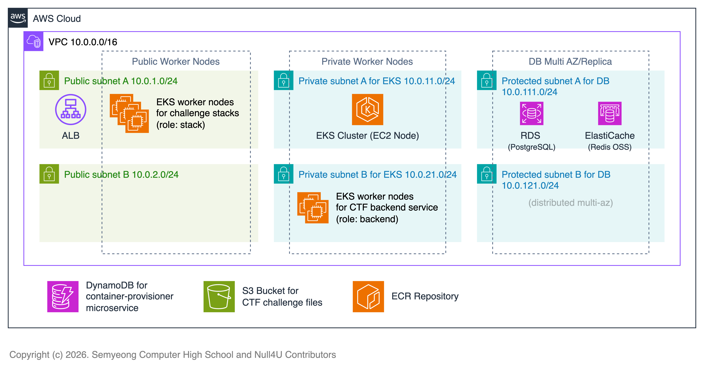
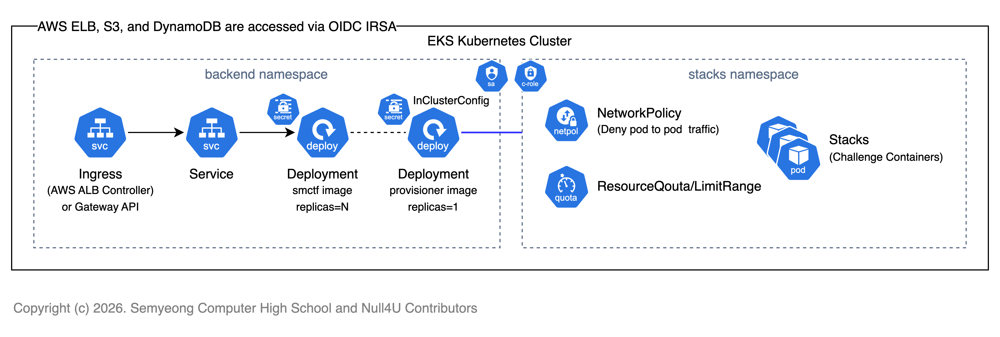
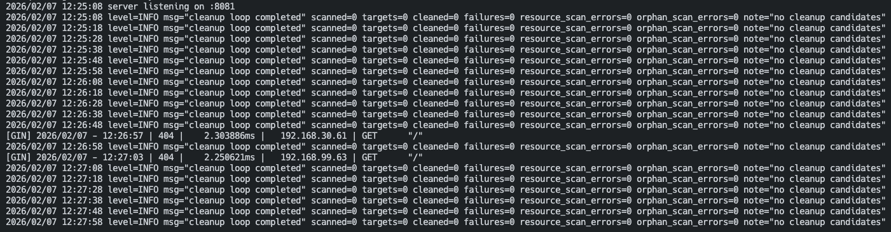

CTF를 운영하였을때, 가장 큰 고민은 **어떻게 참가자들에게 문제별 격리된 환경(컨테이너/VM/인스턴스)을 제공할 것**인가였습니다.

SMCTF 개발팀은 이 문제를 해결하기 위해 여러가지 방안을 고려하였고, 격리된 컨테이너 환경을 제공하기 위해 아래와 같은 컨셉을 도출하였습니다.

- **AWS System Manager Run Command를 통한 EC2 인스턴스 위에서 Docker 컨테이너 오케스트레이션**
- **Kubernetes 기반 오케스트레이션 및 컨테이너 프로비저닝**

첫번째 방법은 CTF 운영 시 발생하는 비용을 최소화할 수 있다는 장점이 있었으나, AWS System Manager Run Command의 제약사항(동시 실행 제한, 대기 시간 등)으로 해당 기능을 구현하는데 있어 적합하지 않다고 판단하였습니다.

또한 워커 노드에 대한 컨테이너 오케스트레이션을 직접 구현해야 한다는 큰 부담이 있었습니다. 이는 보안 이슈로도 적절하지 않았고, 유지보수 측면에서도 많은 어려움이 예상되었습니다.

때문에 저희는 기존의 컨테이너 오케스트레이션 도구인 **Kubernetes**를 활용하는 방안을 선택하였습니다. Kubernetes가 컨테이너 오케스트레이션의 모든 책임을 지게 됨으로써, 저희는 컨테이너 프로비저닝과 관리에 집중할 수 있게 되었습니다.

## 스택(Stack) 및 아키텍처

유저가 특정한 문제에 대해 가상의 격리된 컨테이너 환경을 요청하였을때 제공되는 환경을 **스택**(**Stack**)이라고 정의합니다. 각 스택에 대한 생성 제한은 컨테이너 프로비저너에서 관리하지 않습니다. 이에 대해선 뒤의 [책임 분리 및 원칙](#책임-분리-및-원칙) 섹션에서 다룹니다.

다음은 아키텍처 다이어그램입니다. AWS EKS 클러스터에서 구동된다는 가정하에 작성되었습니다.

EKS 클러스터에서 메인 CTF 서비스 애플리케이션과 컨테이너 프로비저너 등의 마이크로서비스가 구동됩니다. 
이때 컨테이너 프로비저너가 생성하는 스택(컨테이너)는 **파드**(**Pod**) 단위로 생성되며, 스택 파드는 별도의 노드와 네임스페이스에서 격리되어 구동됩니다. (nodeSelector 및 namespace 설정)

이때 스택 파드가 구동되는 노드는 `role=stack` 라벨이 붙은 노드로 제한되며, `stacks` 네임스페이스에서만 생성됩니다. (이는 환경 변수에 따라 변경 가능합니다.)

스택 파드가 구동되는 노드는 Public IP를 가진 노드로 구성되며, 각 스택 파드는 자동으로 생성되는 **NodePort 서비스**를 통해 외부에서 접근할 수 있도록 설계되었습니다. 
포트 범위는 30000-32767 사이로 제한되며, 각 포트는 겹치지 않도록 내부적으로 관리됩니다.

컨테이너 프로비저너의 경우 외부에서 Kubernetes Config 파일과 Context 지정을 통해 쿠버네티스 클러스터에 접근할 수 있으며, 
클러스터 내에서 배포될 땐 InCluster Config를 사용합니다. 이때 SA와 적절한 RBAC 설정(ClusterRole, ClusterRoleBinding 등)을 통해 최소 권한 원칙을 준수합니다. 
이에 대한 자세한 내용은 [설치 및 환경 설정](./3-install.md) 문서에서 다룹니다.

또한 스택이 배포되는 `stacks` 네임스페이스에서 적절한 ResourceQouta 또는 LimitRange를 설정할 수 있고, 필요에 따라 Ingress에 대한 NetworkPolicy를 통해 관련 정책을 구성할 수 있습니다.

ResoureQouta 및 LimitRange는 권장되는 사항이며, 필요에 따라 LimitRange만 구성하고 적절한 오토스케일링 정책을 적용할 수도 있습니다. 
스택을 프로비저닝 할때 CPU/메모리 리소스 요청 및 제한을 반드시 지정하도록 강제하지만, 2차적인 보안을 위해 앞서 언급한 정책들을 적용하는 것을 권장합니다.

가상의 컨테이너 환경인 스택, 즉 파드는 오로지 하나의 Replica로 생성되며 Deployment나 StatefulSet, ReplicaSet을 통해 분산된 파드가 아닌 아닌 **단일 파드와 NodePort 서비스**를 생성합니다.

만약 스택 파드가 생성될 때 여유 리소스가 부족하여 Admission Controller에서 거부되는 경우나 Unschedulable 상태가 되는 경우 자동으로 에러 메시지를 반환합니다. 전자의 경우 `POST /stacks` 요청 시 즉시 반환되며, 후자의 경우 스택의 상태를 조회하는 관련 API 응답에서 확인할 수 있습니다.

## YAML Spec 검증 및 보안 솔루션

컨테이너 프로비저너는 스택 생성 요청 시, 운영자의 휴먼 에러나 적절하지 않은 요청으로 부터 호스트를 보호하기 위해 다양한 검증과 보안 솔루션을 강제로 적용합니다.

- 매니페스트는 공백이나 빈 문자열을 허용하지 않으며, 표준 YAML 형식만 허용합니다.
- 기본적인 필드 검증 및 Pod 단일 오브젝트만 허용합니다. (`kind: Pod` 및 `apiVersion: v1` 만 허용)
- targetPort는 반드시 1-65535 사이의 정수여야 하며, 컨테이너 포트 중 반드시 하나와 매칭되어야 합니다.
- 그 외의 검증에 대한 내용은 [internal/stack/validator.go](https://github.com/nullforu/container-provisioner-k8s/blob/main/internal/stack/validator.go) 소스코드를 참조하세요.

또한 아래의 보안 솔루션이 기본적으로 적용됩니다. 이는 강제로 적용되며, 변경할 수 없습니다.

- 파드 또는 컨테이너 보안 정책 제한을 위해 아래의 필드들은 직접 구성할 수 없으며, YAML 매니페스트에 포함될 경우 에러를 반환합니다.
    - `hostNetwork`, `hostPID`, `hostIPC`, `serviceAccountName`, `deprecatedServiceAccount`, `serviceAccountToken`, `nodeName`, `runtimeClassName`, `ephemeralContainers`, `hostPath`, `securityContext`
- 또한 아래의 필드들은 명시된 값으로 강제로 덮어씌워집니다.
    - `restartPolicy: Never`
    - `automountServiceAccountToken: false`
    - `enableServiceLinks: false`
    - `securityContext.seccompProfile.type: RuntimeDefault`
    - `privileged: false`
    - `allowPrivilegeEscalation: false` 등등. 

이는 곧 컨테이너 격리 및 호스트 워커 노드를 보호하기 위한 최소한의 보안 조치로, 스택 파드는 절대로 특권을 가질 수 없습니다. (non-privileged)

또한 스택 파드는 CTF 참여자의 페이로드에 따라 언제든지 종료되거나 OOM 등의 문제가 발생할 수 있습니다.

하지만 모든 문제(챌린지)는 동일한 환경에서 의도된 페이로드로 검증이 완료되었고, 때문에 이는 의도된 동작이므로 이에 대한 책임은 참여자 본인에게 있습니다.

**또한 최소한의 보안 조치가 적용되었음에도 불구하고, 참여자가 어떠한 방법으로든 호스트 워커 노드에 영향을 미치거나 다른 스택 파드에 영향을 미치는 행위가 발생할 경우 이는 부정 행위 및 운영 방해로 간주되며, 즉시 퇴출되거나 적절한 제재가 가해질 수 있습니다.**

## TTL 및 스케줄러

컨테이너 프로비저너는 내부적으로 DynamoDB를 통해 스택과 관련된 메타데이터를 관리합니다. 때문에 DDB의 메타데이터와 쿠버네티스의 클러스터 상태가 일치하지 않을 경우가 있을 수 있고,
이는 곧 Orphaned 스택 파드를 만들어 리소스를 낭비하는 결과를 초래할 수 있습니다. 이를 방지하기 위해 컨테이너 프로비저너는 주기적으로 DDB와 쿠버네티스 클러스터 상태를 비교하여 불일치하는 스택 파드를 정리하는 작업(Cleanup)을 수행합니다.

Cleanup은 아래의 조건에 따라 수행됩니다.

- **스택 파드 또는 매칭된 서비스가 존재하지 않는 경우** (DDB에는 존재하지만 쿠버네티스 클러스터에는 없는 경우, 또는 그 반대의 경우)
- **스택의 TTL(Time-To-Live)이 만료된 경우**

이처럼 컨테이너 프로비저너는 주기적으로 스케줄링되어 불필요한 리소스를 삭제하며 스택의 TTL을 관리합니다. 스택의 TTL은 기본값 2시간이며, 이는 환경 변수를 통해 변경할 수 있습니다.

스케줄링 간격은 기본값 10초로, 이 또한 환경 변수를 통해 변경할 수 있습니다. 과도하게 짧은 간격의 경우 그 만큼의 리소스 소모가 발생할 수 있고, 너무 긴 간격의 경우 UX에 영향을 미칠 수 있기 때문에 적절하게 판단하세요.

## 책임 분리 및 원칙

프로젝트를 계획하면서 가장 중요하게 판단된 부분이 각 마이크로서비스에 대한 **책임 분리**(**Separation of Concerns**)였습니다. 컨테이너 프로비저너는 오로지 **컨테이너 프로비저닝에 대한 인터페이스 제공 및 라이프사이클 관리**(**스케줄링**)에만 집중하며, 컨테이너 오케스트레이션에 대한 책임은 쿠버네티스가 전적으로 책임집니다.

또한 컨테이너 프로비저너는 스택 생성 요청에 대한 검증 및 보안 솔루션 적용에 집중하며, 유저 인증 및 권한 관리와 제한과 같은 부분은 메인 CTF 서비스 애플리케이션에서 책임집니다. 이는 곧 프로젝트가 단일 책임 원칙(Single Responsibility Principle)을 준수하도록 설계되었음을 의미합니다.

이에 대한 관련 이슈는 아래의 링크를 참조하세요.

- https://github.com/nullforu/container-provisioner-k8s/issues/1
