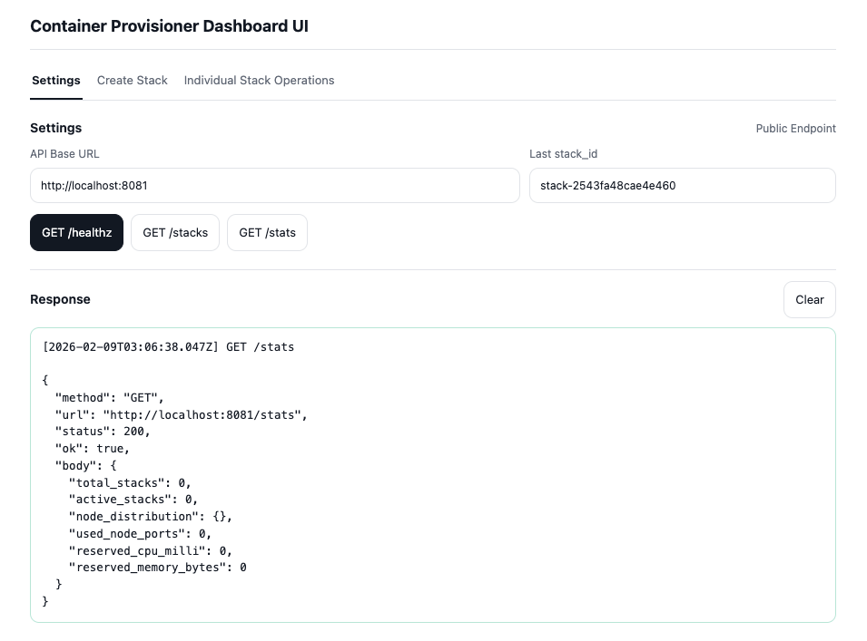
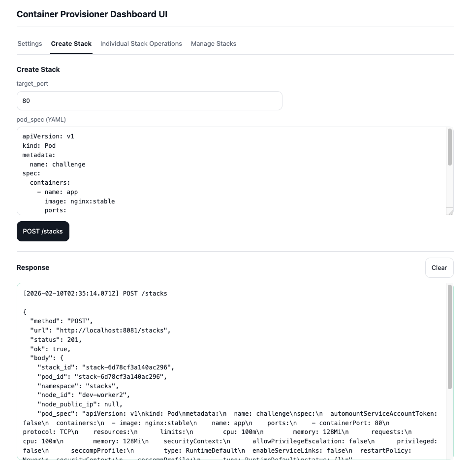
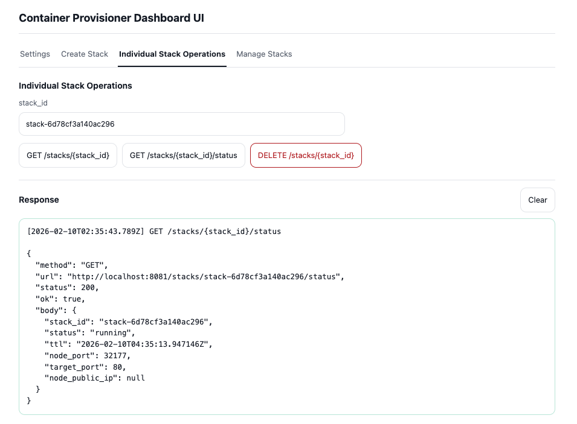

Container Provisioner는 기본적으로 REST API 기반의 마이크로서비스로 동작하며, 편의를 위해 간단한 웹 인터페이스인 대시보드를 제공합니다.

대시보드는 기본적으로 Base URL의 `/dashboard` 경로에서 접근할 수 있으며 스택의 생성, 삭제 및 상태 확인 등의 모든 REST API 기능을 사용할 수 있도록 합니다.

**외부로 노출되지 않는 내부 마이크로서비스이기 때문에 대시보드를 포함하여 전체적인 REST API에 대해 별도의 AuthN 및 AuthZ를 요구하지 않습니다. 때문에 절대로 퍼블릭 네트워크에 노출되지 않도록 주의해야 합니다.**

---

대시보드 UI는 아래와 같이 구성되어 있습니다. 기본적인 REST API 기능을 포함하고 있으나, 고급 기능은 포함하고 있지 않습니다.

### Settings

기본적인 API Base URL이나 `GET /healthz`, `GET /stacks`, `GET /stats`와 같은 Container Provisioner의 상태를 확인할 수 있는 기능을 제공합니다.

### Create Stack

스택 생성 기능을 제공합니다. Pod Spec(YAML)과 Target Port를 입력하여 스택을 생성할 수 있습니다. `POST /stacks` API를 호출합니다.

### Individual Stack Operations

스택 상세 조회, 요약 정보, 삭제 기능을 제공하며 각각 `GET /stacks/{stack_id}`, `GET /stacks/{stack_id}/status`, `DELETE /stacks/{stack_id}` API를 호출합니다.

---

대시보드를 통하지 않고 REST API를 호출하여 Container Provisioner에 대한 작업을 직접 수행할 수도 있습니다. Postman이나 curl과 같은 도구를 활용하여 API를 호출할 수 있습니다.
