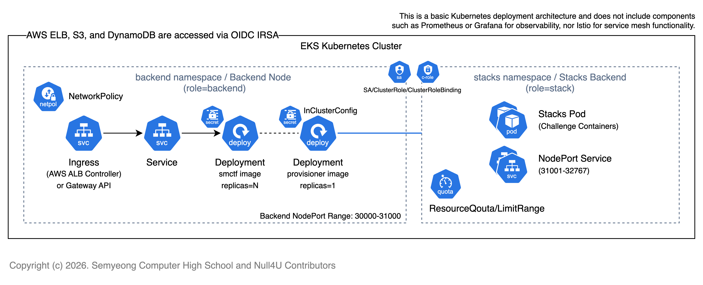

Container Provisioner는 모든 CTF 참가자들을 대상으로 격리된 컨테이너 환경을 제공하기 위해 설계되었습니다.
따라서 개발팀은 보안 및 안정성 측면에서 아래와 같은 질문에 대해 고민하였고, 이에 대한 해결책을 마련하였습니다.

### 호스트 보호

컨테이너 환경 특성상 기본적으로 호스터와 격리된 환경을 제공하지만, 
호스트의 커널을 공유하기 때문에 Docker 또는 Kubernetes의 호스트와 관련된 보안 이슈가 발생할 수 있습니다.

이를 방지하기 위해 적용되는 보안 옵션은 이전에 다루었던 [YAML Spec 검증 및 보안 솔루션](/container-provisioner/3-validate) 문서에서 다루었습니다.
해당 문서를 참조하세요.

이러한 옵션들로 인해 호스트가 보호되며 제로데이 급의 취약점이 발생하지 않는 이상 스택 Pod 또는 컨테이너에 의해 호스트가 침해되는 상황은 발생하지 않을 것으로 판단합니다.

확실한 호스트 보호를 위해선 Native Kubernetes 아키텍처가 아닌 다른 백엔드를 활용하는 방안을 고려해볼 수 있으나, 공식적으로 다루는 Container Provisioner는 Native Kubernetes 아키텍처를 기반으로 합니다.

### 리소스 제한

Container Provisioner는 스택 Pod가 생성될 때 리소스 제한이 반드시 설정되었는지 확인합니다. 때문에 운영자는 적절한 리소스 요청량 및 제한량을 구성하여 하나의 스택 Pod가 과도하게 리소스를 점유하는 상황을 방지할 수 있습니다.
상황에 따른 적절한 리소스 요청량 및 제한량 설정은 [리소스/인스턴스 유형 선택 방법](/container-provisioner/7-consider-resource) 문서를 참고하세요.

추가적으로 리소스 요청량과 제한량을 동일하게 설정하여 Guaranteed QoS 클래스로 스택 Pod가 생성되도록 강제합니다. 이는 스택 Pod가 스케줄링된 노드에서 확실히 리소스를 보장받도록 하기 위함입니다.

Container Provisioner의 원칙 및 컨셉에 따라 스택 Pod는 항상 단일 Pod로 생성되며, 분산 및 스케일링이 진행되지 않고 복구 전략 또한 존재하지 않습니다. 
참여자의 공격 페이로드로 인해 Non-Zero Killed나 OOM Killed 등이 발생하는 상황이 발생해도 이는 의도된 동작으로 간주합니다. 

스택 Pod가 구동되는 Public IP를 가진 워커 노드 및 백엔드와 마이크로서비스가 구동되는 프라이빗 워커노드를 확실하게 구분하기 위해 `role` 라벨을 활용합니다.
스택 Pod는 `role=stack` 라벨이 붙은 노드에서만 스케줄링되도록 강제되며, 백엔드는 `role=backend` 라벨이 붙은 노드에서만 구동되도록 합니다.

만약 스택 Pod가 구동되는 노드에서 리소스 부족으로 인해 스케줄링이 불가능한 경우, Container Provisioner는 즉시 에러 메시지를 반환합니다.
이렇듯 리소스가 부족한 상황이 되면 자동으로 에러를 반환하지만, 여유를 두기 위해 적절한 ResourceQuota 및 LimitRange를 설정하는 것을 권장합니다.

이에 대해선 마찬가지로 [리소스/인스턴스 유형 선택 방법](/container-provisioner/7-consider-resource) 문서를 참고하세요.

```yaml
apiVersion: v1
kind: ResourceQuota
metadata:
  name: stacks-resource-quota
  namespace: stacks
spec:
  hard:
    requests.cpu: "8" # For example
    requests.memory: "8Gi"
    limits.cpu: "8"
    limits.memory: "8Gi"
---
apiVersion: v1
kind: LimitRange
metadata:
  name: stacks-limit-range
  namespace: stacks
spec:
  limits:
    - type: Container
      max:
        cpu: "256m"
        memory: "256Mi"
      default:
        cpu: "256m"
        memory: "256Mi"
      defaultRequest:
        cpu: "256m"
        memory: "256Mi"
```

### 네트워크 격리 및 인프라 레벨의 보안

호스트와 스택 Pod 간의 네트워크 격리는 기본적으로 [YAML Spec 검증 및 보안 솔루션](/container-provisioner/3-validate)에 따라 보장됩니다.

하지만 같은 쿠버네티스 클러스터 내에서 구동되는 스택 Pod 간 또는 백엔드 마이크로서비스와의 네트워크 격리는 인프라 레벨에서 보장해야 합니다.

스택 Pod와 스택 Pod 간의 네트워크 격리는 기본적으로 적용되지 않으며, 이에 대한 내용은 [NetworkPolicy 구성](/container-provisioner/6-networkpolicy) 문서에서 다룹니다.

또한 스택 Pod와 백엔드 및 마이크로서비스 간의 네트워크 격리는 반드시 적용되어야 하며 마찬가지로 [NetworkPolicy 구성](/container-provisioner/6-networkpolicy) 문서에서 다룹니다.
추가적으로 스택 Pod가 구동되는 노드는 퍼블릭 IP를 통해 NodePort로 접근되기 때문에 인프라 레벨에서 퍼블릭 네트워크 접근 제어가 반드시 적용되어야 합니다.

이때 백엔드의 NodePort와 스택의 NodePort를 구분하기 위해 기본적으로 백엔드는 30000-31000, 스택은 31001-32767 범위를 사용하도록 설계되었습니다.
인프라 레벨에서 허용 가능한 스택의 NodePort 범위를 31001-32767 포트 사이의 TCP/UDP 트래픽에 한정하여 `0.0.0.0/0`에서 접근할 수 있도록 설정하세요.

백엔드의 NodePort(30000-31000)는 퍼블릭 네트워크에서 접근할 수 없도록 설정해야 하며, 백엔드는 오로지 Ingress나 API Gateway 등을 통해 프로비저닝된 ELB에서만 접근할 수 있도록 설정해야 합니다.

이들은 프로젝트의 인프라 코드에서 기본적으로 적용됩니다. 자세한 내용은 [인프라](/infra) 문서를 참고하세요.


