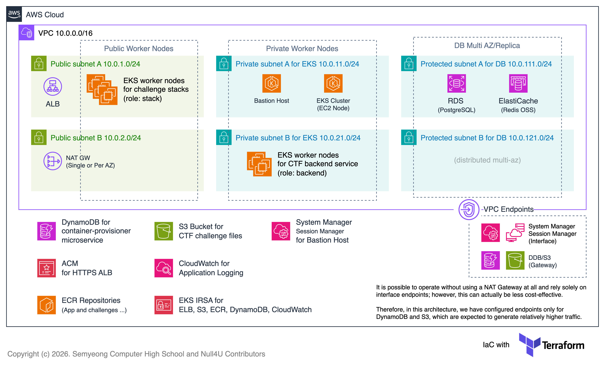

AWS 아키텍처는 SMCTF 백엔드 및 Container Provisioner, 스택 구성 요소를 호스팅하기 위한 EKS 클러스터를 포함하여 다양한 리소스 및 IRSA 등이 포함되어 있습니다. 
또한 아래의 아키텍처 다이어그램에선 명시되어 있지 않지만 EKS 노드와 컨트롤 플레인, DB 보안그룹 등은 명확하게 네트워크 트래픽이 제한되어 있습니다.

### 아키텍처 다이어그램



아키텍처에서 고려해야할 요소는 아래와 같습니다.

- 안정성(가용성)
- 보안성
- 확장성
- 비용 효율성

이를 위해 SMCTF는 기본적으로 최소 2개 이상의 AZ에 컴퓨팅 리소스가 분산되도록 설계되어 있고 최소 권한 원칙을 적용하여 리소스에 대한 액세스를 제한합니다.

또한 필요에 따라 Terraform 또는 Helm 차트를 수정하여 쉽게 확장할 수 있도록 설계되어 있고, 비용 효율성을 위해 NAT Gateway를 단일 AZ/또는 리전 단위로 배포하는 옵션과 단일 DB 인스턴스 배포 옵션 등의 다양한 배포 옵션을 제공합니다. 

VPC 엔드포인트는 비교적 트래픽이 많은 S3 및 DynamoDB에 대한 Gateway 엔드포인트가 구성되어 있습니다. 그 외의 리소스에 대한 인터페이스 엔드포인트도 고려하였으나, 비용 효율성 측면에서 NAT Gateway를 같이 사용하는 옵션이 더 낫다고 판단하여 배포 옵션에서 제외하였습니다.
필요 시 직접 Terraform 구성을 수정하여 인터페이스 엔드포인트를 추가할 수 있습니다.

### 서브넷 구성

서브넷은 직접적으로 인터넷 게이트웨이와 연결되어 노출되는 Public 서브넷과 백엔드 애플리케이션이 배포되는 Private 서브넷, 그리고 DB가 배포되는 Protected 서브넷으로 구성되어 있습니다.
각 서브넷은 최소 2개 이상의 AZ에 분산되어 배포됩니다.

Public 서브넷엔 ALB(by AWS LB Controller)와 NAT Gateway, 그리고 EKS 노드 중 스택 노드(`role=stack`)가 배포되어 있습니다.
스택 노드는 각각 Public IP를 할당받고, 31001-32767 포트 범위에서 노출되어 사용자에게 스택에 대한 엑세스 포인트를 제공합니다.

스택 노드는 백엔드 노드와 CoreDNS 통신을 위한 DNS 53포트만 허용하며, 그 밖의 트래픽은 허용하지 않습니다. 
스택 노드에서 리소스를 관리하는 주체는 쿠버네티스 컨트롤 플레인이므로 내부적으로 컨트롤 플레인과 통신할 수 있도록 허용되어 있습니다. 

이러한 자세한 네트워크 구성은 직접 [Terraform 구성](https://github.com/nullforu/smctf-infra)을 참조하세요.

### Bastion Host

Private 서브넷에 배치되는 Bastion Host는 EKS 클러스터의 노드에 접속하거나 DB에 접속하기 위해 옵션에 따라 활성화할 수 있습니다.

Bastion Host는 System Manager의 Session Manager를 통해 접근할 수 있으며, 이와 관련된 IAM 역할 및 VPC 엔드포인트는 기본적으로 구성되어 있습니다.
이 또한 마찬가지로 Terraform 변수로 활성화 여부를 선택할 수 있습니다.

예시의 PostgreSQL Client 설치 및 접속 명령어는 아래와 같습니다.

```bash
aws ssm start-session --target <bastion_instance_id>
```

```bash
sudo yum update -y
sudo amazon-linux-extras install postgresql17 epel -y
sudo yum install postgresql -y

RDS_HOST="smctf-dev-postgres.<...>.ap-northeast-2.rds.amazonaws.com" 
psql "host=$RDS_HOST port=5432 dbname=app_db user=app_user password=<DB_PASSWORD>"
```

```bash
sudo yum install redis -y

REDIS_HOST="smctf-dev-redis.<...>.ng.0001.apn2.cache.amazonaws.com"
redis-cli -h $REDIS_HOST -p 6379
```

### IRSA

EKS 클러스터 내 리소스가 ELB, S3, DDB, CloudWatch에 접근할 수 있도록 OIDC IRSA(IAM Roles for Service Accounts)가 기본적으로 구성되어 있습니다.

- `...-irsa-alb` (ELB)
- `...-irsa-backend` (S3)
- `...-irsa-container-provisioner` (DDB)
- `...-irsa-fluentbit` (CloudWatch Logs) 

### EKS 클러스터

EKS 클러스터는 기본적으로 Kubernetes 1.35 버전으로 배포되며 필요 시 수정할 수 있습니다. EKS 클러스터는 Control Plane과 Node Group으로 구성되어 있고 Node Group은 스택 노드(`role=stack`)와 백엔드 노드(`role=backend`)로 구성되어 있습니다.
각 노드의 역할은 [Container Provisioner](/container-provisioner) 문서를 참조하세요.

Kubernetes 오브젝트/리소스는 Helm 차트를 통해 배포되며 자세한 내용은 [Kubernetes 아키텍처](/infra/3-k8s) 및 [Helm 차트 구성](/infra/5-helm) 문서를 참조하세요.

### ECR

ECR은 스택과 백엔드 애플리케이션이 사용하는 컨테이너 이미지, 그리고 스택을 제공하는 문제들을 위한 컨테이너 이미지를 저장하는데 사용됩니다. 
Github Actions를 통해 이미지를 쉽게 빌드하고 배포할 수 있도록 하는 [Docker Image Builder](/image-builder)가 준비되어 있습니다.

---

자세한 내용은 [Terraform 구성](/infra/4-terraform) 및 [Helm 차트 구성](/infra/5-helm) 문서를 참조하세요.
