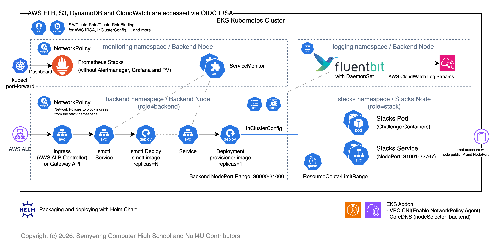

EKS 클러스터 내에서 Kubernetes 리소스는 Helm 차트를 통해 배포됩니다. 
여기엔 SMCTF 백엔드 및 Container Provisioner, Ingress와 SA/RBAC 리소스 등이 포함됩니다.

NetworkPolicy Agent를 위해 EKS 클러스터는 VPC CNI 플러그인(애드온)에서 NetworkPolicy를 사용하도록 구성되어 있습니다.
이는 스택 네임스페이스 내 Pod에서 Backend를 비롯한 다른 네임스페이스의 리소스에 대한 네트워크 트래픽을 제한하는데 사용됩니다.

### Kubernetes 아키텍처

#### Backend 네임스페이스

SMCTF 백엔드 및 Container Provisioner 애플리케이션이 배포되는 네임스페이스로 워커 노드 중 `role=backend`인 백엔드 노드에 배포됩니다.

여기엔 백엔드 애플리케이션과 관련된 Deployment, Service, ConfigMap, Secret 등의 리소스와 함께 Ingress 리소스도 포함되어 있습니다. (AWS LB Controller를 통해 ALB로 프로비저닝됨)

Container Provisioner는 InCluster 모드로 배포되어 Kubernetes API 서버와 통신합니다. 스택 노드에 스택을 프로비저닝하는 역할을 합니다.

#### Stack 네임스페이스

스택이 배포되는 네임스페이스로 워커 노드 중 `role=stack`인 스택 노드에 배포됩니다. 스택 노드에선 오로지 스택만 배포되며 타 네임스페이스에서 스택으로 부터의 Ingress 트래픽을 제한하는 NetworkPolicy가 적용되어 있습니다.
(백엔드 네임스페이스 및 모니터링 네임스페이스에서 적용)

이들은 노드의 Public IP와 함께 NodePort 31001-32767 포트 범위에서 노출되어 사용자에게 스택에 대한 엑세스 포인트를 제공합니다.

#### Monitoring 네임스페이스

Prometheus와 같은 모니터링 애플리케이션이 배포되는 네임스페이스로 워커 노드 중 `role=backend`인 백엔드 노드에 배포됩니다.
리소스 절약을 위해 Alertmanager나 Grafana와 같은 다른 모니터링 애플리케이션은 배포되지 않으며, 필요 시 추가로 배포할 수 있습니다.

Prometheus에 대한 ServiceMonitor 리소스는 Helm 차트에 포함되며 백엔드 애플리케이션과 Container Provisioner에 대한 `/metrics` 모니터링이 기본적으로 구성되어 있습니다.
Prometheus 대시보드는 `kubectl port-forward`를 통해 접근할 수 있도록 안내합니다.

#### Logging 네임스페이스

FluentBit가 배포되는 네임스페이스로, FluentBit는 EKS 클러스터 내에서 실행되는 애플리케이션의 로그를 수집하여 CloudWatch Logs로 전송하는 역할을 하며 DaemonSet으로 배포됩니다.

---

자세한 내용은 [Helm 차트 구성](/infra/5-helm) 문서를 참조하세요.
