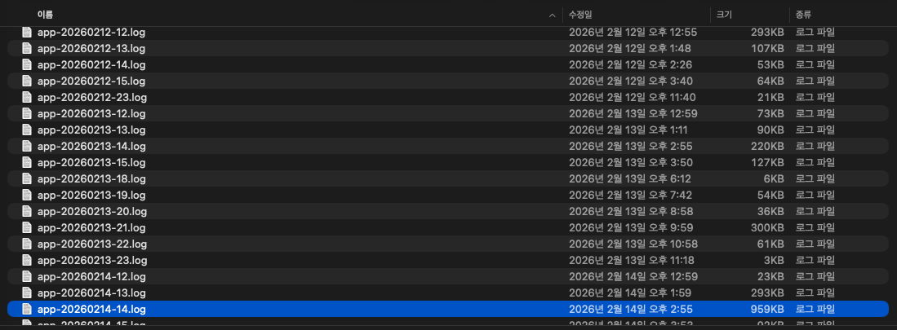
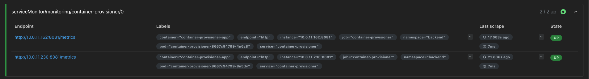
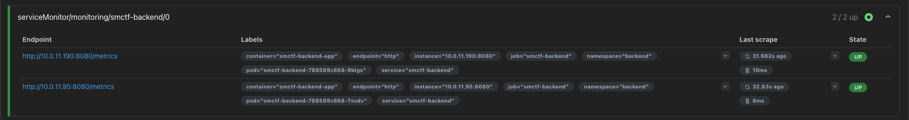
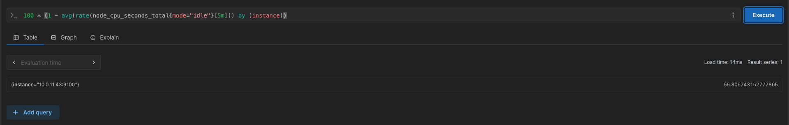
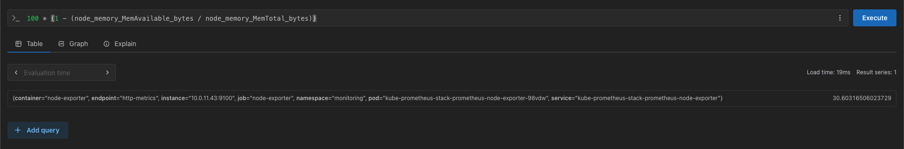
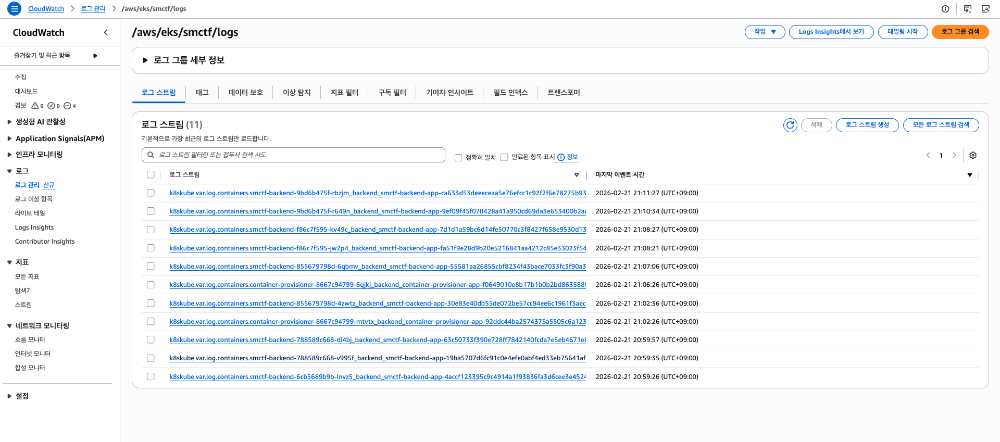
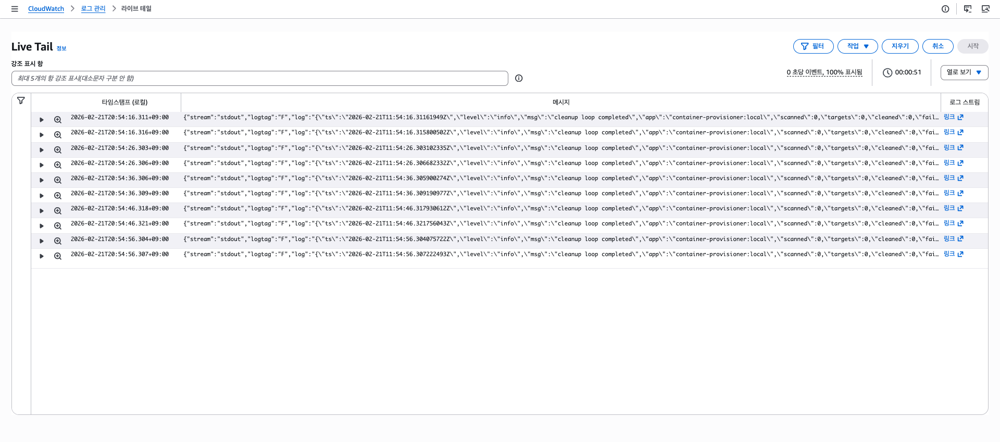
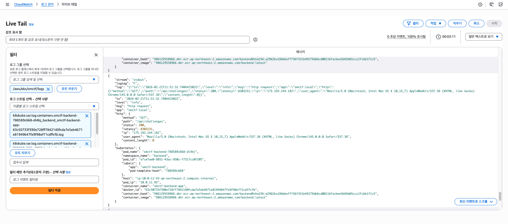

SMCTF는 관측성(Observability)을 위해 Prometheus를 통한 성능 모니터링과 FluentBit를 통한 로그 수집 및 CloudWatch Logs로의 전송을 기본적으로 구성하여 제공합니다.

### Backend 및 Container Provisioner 관측성 지원

이를 위해서 Backend 및 Container Provisioner 애플리케이션은 아래와 같은 관측성 지원을 포함하도록 설계되었습니다.

- JSON으로 구조화된 stdout/stderr 로깅 지원 및 Rotating 로그 파일 저장
- `/metrics` Openmetrics 엔드포인트를 통한 성능 모니터링 지원



이때 JSON 스키마는 맨 아래에 따로 첨부합니다. 사용자의 개인정보 보호를 위해 민감한 정보가 포함되지 않도록 아래의 엔드포인트는 로깅 시 Body를 포함하지 않습니다.

- `/api/auth/login`
- `/api/auth/register`
- `/api/auth/refresh`
- `/api/auth/logout`
- `/api/admin/challenges`
- `/api/admin/challenges/{id}` 
- `/api/challenges/{id}/submit`

```
{"ts":"2026-02-21T12:13:49.181622+09:00","level":"info","msg":"http request","app":"smctf:local","http":{"method":"POST","path":"/api/challenges/1/submit","status":200,"latency":16481000,"ip":"::1","user_agent":"Mozilla/5.0 (Macintosh; Intel Mac OS X 10_15_7) AppleWebKit/537.36 (KHTML, like Gecko) Chrome/145.0.0.0 Safari/537.36","content_type":"application/json","content_length":15,"user_id":1}}
{"ts":"2026-02-21T12:13:49.190174+09:00","level":"info","msg":"http request","app":"smctf:local","http":{"method":"GET","path":"/api/me","status":200,"latency":1063000,"ip":"::1","user_agent":"Mozilla/5.0 (Macintosh; Intel Mac OS X 10_15_7) AppleWebKit/537.36 (KHTML, like Gecko) Chrome/145.0.0.0 Safari/537.36","content_length":0,"user_id":1}}
{"ts":"2026-02-21T12:13:49.203525+09:00","level":"info","msg":"http request","app":"smctf:local","http":{"method":"GET","path":"/api/teams/1/solved","status":200,"latency":5614000,"ip":"::1","user_agent":"Mozilla/5.0 (Macintosh; Intel Mac OS X 10_15_7) AppleWebKit/537.36 (KHTML, like Gecko) Chrome/145.0.0.0 Safari/537.36","content_length":0}}
```

### Prometheus 구성

Prometheus는 EKS 클러스터 내에서 실행되는 애플리케이션의 성능 모니터링을 위해 기본적으로 구성되어 있습니다.
Prometheus Stack Helm 차트를 통해 설치되며, 불필요한 리소스 낭비를 막기 위해 Alertmanager나 Grafana와 같은 다른 모니터링 애플리케이션은 배포되지 않습니다. 필요 시 추가로 배포할 수 있습니다.

스택 노드에 배치되지 않도록 반드시 아래의 Helm 명령어를 통해 설치하세요.

```shell
helm repo add prometheus-community https://prometheus-community.github.io/helm-charts    
helm repo update

helm upgrade --install kube-prometheus-stack prometheus-community/kube-prometheus-stack \
  -n monitoring --create-namespace \
  --set grafana.enabled=false \
  --set alertmanager.enabled=false \
  --set prometheus.prometheusSpec.nodeSelector.role=backend \
  --set prometheusOperator.nodeSelector.role=backend \
  --set kubeStateMetrics.nodeSelector.role=backend \
  --set nodeExporter.nodeSelector.role=backend
```

SMCTF Helm 차트엔 아래와 같은 Prometheus 모니터링 관련 구성이 포함되어 있습니다. 특별한 경우가 아니라면 기본값을 권장하며, 필요 시 수정하여 사용할 수 있습니다.

```yaml
monitoring:
  enabled: true
  namespace: monitoring
  serviceMonitor:
    labels:
      release: kube-prometheus-stack
    interval: 10s
    scrapeTimeout: 5s
    metricsPath: /metrics
    serviceSelectorLabels:
      backend:
        app.kubernetes.io/name: backend
      containerProvisioner:
        app.kubernetes.io/name: container-provisioner
```

#### Prometheus 대시보드

설치 후 `kubectl port-forward`를 통해 Prometheus 대시보드에 접근할 수 있습니다.
Prometheus 스택 버전에 따라 서비스 명칭이 다를 수 있으니, 설치 후 `kubectl -n monitoring get svc` 명령어로 Prometheus 서비스의 이름을 확인하여 포트 포워딩 명령어를 수정하여 사용하세요.

```bash
kubectl -n monitoring port-forward svc/kube-prometheus-stack-prometheus 9090:9090
```

설치 후 Prometheus 대시보드에서 타겟에 잘 올라오는지 확인하세요. 백엔드 애플리케이션과 Container Provisioner에 대한 `/metrics` 모니터링이 기본적으로 구성되어 있고 ServiceMonitor CRD가 기본적으로 SMCTF Helm 차트에 포함됩니다.





Up으로 잘 보여진다면 이제 아래와 같이 간단하게 PromQL을 통해 모니터링할 수 있습니다. (예: 노드의 평균 CPU 사용률 등)

```promql
100 * (1 - avg(rate(node_cpu_seconds_total{mode="idle"}[5m])) by (instance))
```





필요 시 Prometheus 스택 Helm 설치 과정에서 Grafana를 활성화하여 사용할 수도 있습니다. 다만 리소스 절약을 위해 기본적으로는 비활성화되어 설명하였습니다.

### FluentBit 구성 및 CloudWatch Logs

FluentBit는 EKS 클러스터 내에서 실행되는 애플리케이션의 로그를 수집하여 CloudWatch Logs로 전송하는 역할을 하며 DaemonSet으로 배포됩니다.
FluentBit가 수집하는 로그는 기본적으로 모든 `backend` 네임스페이스 내 Pod의 로그만 수집합니다. 필요 시 다른 네임스페이스의 로그도 수집하도록 FluentBit 구성을 수정할 수 있습니다. (Input, Filter, Output, Parser 등)

이와 관련된 SMCTF Helm 차트 구성은 아래와 같습니다. 특별한 경우가 아니라면 기본값을 권장하며, 필요 시 수정하여 사용할 수 있습니다.

```yaml
fluentbit:
  enabled: true
  namespace: logging
  configMapName: fluent-bit-config
  serviceAccount:
    name: fluent-bit-cloudwatch
    annotations:
      eks.amazonaws.com/role-arn: arn:aws:iam::<AWS_ACCOUNT_ID>:role/smctf-dev-irsa-fluentbit
  image:
    repository: amazon/aws-for-fluent-bit
    tag: 3.2.2
    pullPolicy: IfNotPresent
  env:
    AWS_REGION: "ap-northeast-2"
    LOG_GROUP_NAME: "/aws/eks/smctf-dev/logs"
    LOG_STREAM_PREFIX: "k8s"
  resources:
    requests:
      cpu: "50m"
      memory: "100Mi"
    limits:
      cpu: "200m"
      memory: "200Mi"
  nodeSelector: {}
  tolerations: []
```

DaemonSet으로 직접 배포되기 때문에 별도의 FluentBit Helm 차트를 설치할 필요는 없습니다만, 필요 시 `fluentbit.enabled: true`로 설정하고 직접 설치할 수도 있습니다.

정상적으로 설치가 되었다면 아래와 같이 CloudWatch Logs에서 로그 그룹과 로그 스트림이 생성되고 로그가 수집되는 것을 확인할 수 있습니다.





또한 Live Tail을 통해 실시간으로 로그가 수집되는 것을 확인할 수도 있습니다.



애플리케이션에선 구조화된 JSON 로깅을 지원하므로 CloudWatch Logs Insights에서 아래와 같이 간단한 쿼리를 통해 로그를 분석할 수도 있습니다.

---

**Structured Logging(JSON) Schema**

```json
{
    "$schema": "https://json-schema.org/draft/2020-12/schema",
    "title": "SMCTF Log Event",
    "type": "object",
    "additionalProperties": true,
    "required": ["ts", "level", "msg", "app"],
    "properties": {
        "ts": {
            "type": "string",
            "format": "date-time",
            "description": "RFC3339 timestamp with timezone"
        },
        "level": {
            "type": "string",
            "enum": ["debug", "info", "warn", "error"]
        },
        "msg": { "type": "string" },
        "app": { "type": "string" },
        "legacy": { "type": "boolean" },
        "error": {},
        "stack": { "type": "string" },
        "http": {
            "type": "object",
            "additionalProperties": true,
            "properties": {
                "method": { "type": "string" },
                "path": { "type": "string" },
                "status": { "type": "integer" },
                "latency": { "type": "string" },
                "ip": { "type": "string" },
                "query": { "type": "string" },
                "user_agent": { "type": "string" },
                "content_type": { "type": "string" },
                "content_length": { "type": "integer" },
                "user_id": { "type": "integer" },
                "body": { "type": "string" }
            }
        }
    }
}
```
