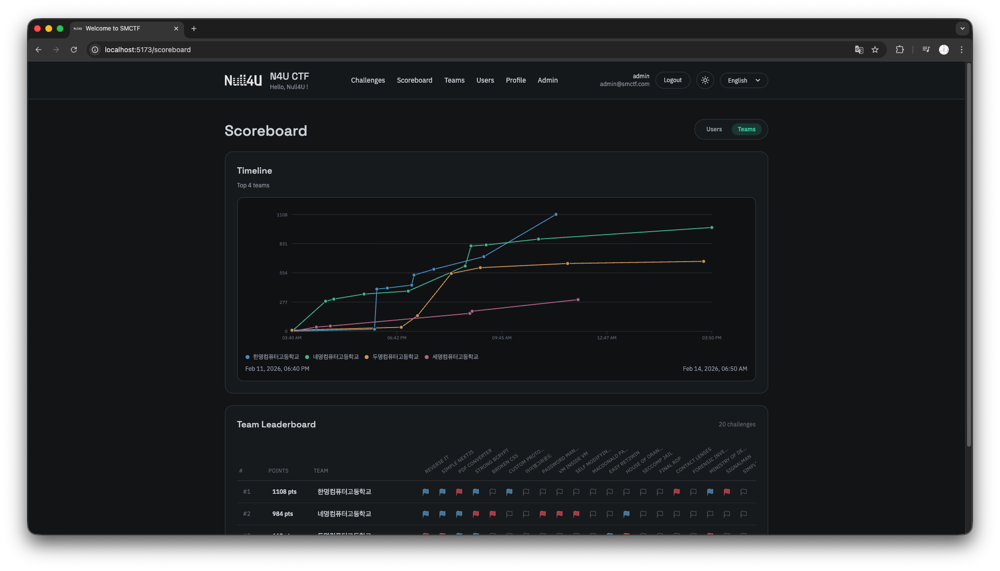

SMCTF는 기본적으로 라이트 모드와 다크 모드를 지원합니다. 헤더의 햇빛 모양 또는 달 모양 아이콘을 클릭하여 라이트 모드와 다크 모드 사이를 전환할 수 있습니다.

**Dark Mode**




**Light Mode**


각 색상에 대해 직접 커스텀하려면 [프론트엔드](https://github.com/nullforu/smctfe)의 CSS를 수정해야합니다. 기본적으로 제공되는 RGB 색상은 변수로 저장되어 있으며, 아래와 같습니다.

```css
:root {
    color-scheme: light;

    --color-bg: 245 247 249;
    --color-surface: 255 255 255;
    --color-surface-muted: 242 244 247;
    --color-surface-subtle: 235 238 242;

    --color-border: 216 221 228;

    --color-text: 26 32 44;
    --color-text-muted: 78 88 105;
    --color-text-subtle: 110 120 135;
    --color-text-inverse: 255 255 255;

    --color-accent: 14 139 126;
    --color-accent-strong: 11 112 102;
    --color-accent-foreground: 255 255 255;

    --color-secondary: 92 99 110;
    --color-secondary-foreground: 255 255 255;

    --color-danger: 200 45 65;
    --color-danger-strong: 165 35 52;
    --color-danger-foreground: 255 255 255;

    --color-warning: 210 135 30;
    --color-warning-strong: 170 100 20;
    --color-warning-foreground: 255 255 255;

    --color-success: 30 150 95;
    --color-success-strong: 20 115 75;
    --color-success-foreground: 255 255 255;

    --color-info: 45 120 190;

    --color-ring: 14 139 126;

    --color-overlay: 0 0 0;

    --color-contrast: 26 32 44;
    --color-contrast-foreground: 255 255 255;

    --app-bg: 250 250 250;
    --app-radial: 30 38 50;

    --selection-bg: 40 120 110;
    --selection-text: 240 244 248;

    --chart-1: 70 160 210;
    --chart-2: 60 180 140;
    --chart-3: 220 170 80;
    --chart-4: 210 120 160;
    --chart-5: 150 130 210;
    --chart-6: 230 140 70;
    --chart-7: 70 190 200;
    --chart-8: 220 100 100;
    --chart-9: 90 200 130;
    --chart-10: 110 150 220;
}

.dark {
    color-scheme: dark;

    --color-bg: 17 19 22;
    --color-surface: 24 27 31;
    --color-surface-muted: 14 16 19;
    --color-surface-subtle: 30 34 39;

    --color-border: 58 64 72;

    --color-text: 210 214 220;
    --color-text-muted: 150 158 170;
    --color-text-subtle: 110 118 130;
    --color-text-inverse: 24 27 31;

    --color-accent: 38 180 150;
    --color-accent-strong: 60 210 175;
    --color-accent-foreground: 15 18 21;

    --color-secondary: 130 138 150;
    --color-secondary-foreground: 24 27 31;

    --color-danger: 225 85 100;
    --color-danger-strong: 245 120 135;
    --color-danger-foreground: 24 27 31;

    --color-warning: 220 170 80;
    --color-warning-strong: 240 200 120;
    --color-warning-foreground: 24 27 31;

    --color-success: 60 200 140;
    --color-success-strong: 120 230 180;
    --color-success-foreground: 24 27 31;

    --color-info: 100 160 210;

    --color-ring: 38 180 150;

    --color-overlay: 0 0 0;

    --color-contrast: 210 214 220;
    --color-contrast-foreground: 24 27 31;

    --app-bg: 17 19 22;
    --app-radial: 40 45 50;

    --selection-text: 210 214 220;

    --chart-1: 80 150 200;
    --chart-2: 70 190 150;
    --chart-3: 210 160 90;
    --chart-4: 190 110 150;
    --chart-5: 150 140 210;
    --chart-6: 220 140 80;
    --chart-7: 80 170 190;
    --chart-8: 210 110 110;
    --chart-9: 90 190 140;
    --chart-10: 110 150 210;
}
```
