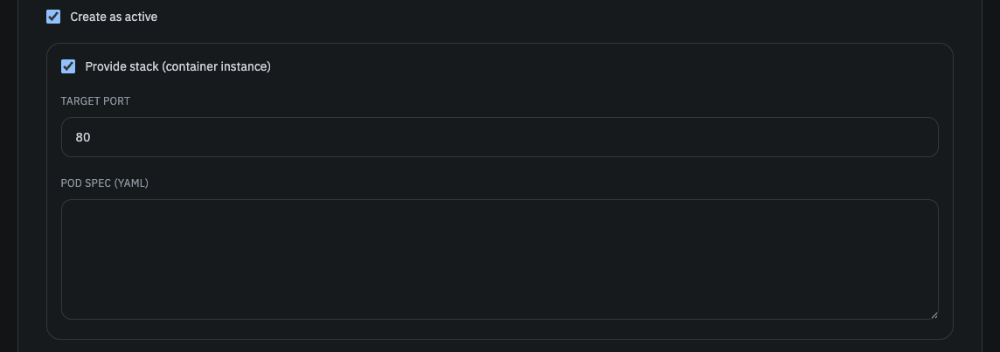

스택은 문제 풀이에 필요한 격리된 컨테이너 환경을 제공하는 솔루션입니다. 스택에 대한 자세한 컨셉과 동작, 구현 원리, 세부 옵션에 대해선 [Container Provisioner](/container-provisioner) 문서를 참조하세요.

이 문서에서는 문제를 생성할 때 어떻게 스택을 구성하는지와 참여자가 스택을 생성할 때 어떠한 제한이 있는지 등을 설명합니다.

### 문제의 스택 설정

[관리자 페이지의 문제 생성 탭](/smctf/admin/1-create-chall)에서 문제를 생성할 때, `Provide stack (container instance)` 옵션을 활성화하면 아래의 두 가지 필드가 추가로 표시됩니다.



#### Target Port

컨테이너 서비스가 노출하는 포트를 입력합니다. 예를 들어 컨테이너 내부에서 8080 포트를 노출해야 한다면 8080을 입력합니다. 이는 Public IP와 매칭되는 NodePort와는 별개로, 컨테이너 내부에서 서비스가 노출하는 포트를 의미합니다.

타켓 포트는 반드시 1-65535 사이의 정수여야 하며, Pod Spec에서 컨테이너 포트 중 반드시 하나와 매칭되어야 합니다. 
단 하나의 타겟 포트만 노출할 수 있으며, 다수의 포트를 노출해야 하는 경우엔 아직 지원하지 않습니다.

#### Pod Spec

참여자에게 제공해주고자 하는 환경에 맞게 Kubernetes Pod Spec을 정의합니다. Pod Spec의 검증과 보안상 제한에 대해선 [Container Provisioner - YAML Spec 검증 및 보안 솔루션](/container-provisioner/3-validate) 문서를 참조하세요.
하나의 Pod에 여러 컨테이너를 정의할 수 있으며, 이때 타겟 포트는 반드시 하나의 컨테이너 포트와 매칭되어야 합니다.

Pod Spec엔 Requests와 Limits를 정의해야 합니다. 이때 CPU와 메모리에 대한 Requests와 Limits를 모두 정의해야 하며, Guaranteed QoS를 위해 Requests와 Limits의 값이 동일해야 합니다.

또한 사용되는 이미지는 미리 Linux AMD64 아키텍처로 빌드되어 ECR 프라이빗 레포지토리에 업로드가 되어있어야 합니다. 출제자는 인프라 팀에 문의하시면 됩니다. 

다만 Pod Spec의 세부 설정이나 요구되는 사양 등은 문제의 난이도와 요구사항에 따라 달라질 수 있으므로, 출제자는 문제의 특성에 맞게 적절히 설정해야 합니다. 이는 [Container Provisioner - 리소스/인스턴스 유형 선택 방법](/container-provisioner/7-consider-resource) 문서에서 자세히 설명되어 있습니다.

예시의 Best Practice는 아래와 같습니다. (실제로 테스트 더미 환경에서 사용되는 Pod Spec입니다.)

```yaml
apiVersion: v1
kind: Pod
metadata:
  name: challenge-nginx-pod
spec:
  containers:
    - name: nginx
      image: nginx:stable
      ports:
        - containerPort: 80
      resources:
        requests:
          cpu: "50m"
          memory: "64Mi"
        limits:
          cpu: "50m"
          memory: "64Mi"
```

내부적으로 기본값 기준 `role=stack` 라벨이 붙은 노드에 스케줄링되며, `stacks` 네임스페이스에 Pod와 Service 리소스가 생성됩니다. 네이밍은 `stack-{stack_id}` 형식입니다.

### 참여자의 스택 생성

스택이 활성화된 문제에선 참여자가 `Create Stack`을 클릭하여 스택을 생성할 수 있습니다. 이때 다음 2가지의 제한이 존재합니다.

- 한명의 유저가 동시에 생성할 수 있는 스택은 최대 3개입니다. 추가적인 스택을 생성하려면 기존 스택을 삭제해야 합니다.
- 스택의 TTL은 2시간입니다. TTL이 만료되면 스택은 자동으로 삭제됩니다. 물론 그 전에 직접 삭제할 수도 있습니다.
- 스택 생성은 1분당 최대 1회로 제한됩니다. 이는 [요청 속도 제한 설정](/smctf/16-rate-limit) 문서에서도 언급합니다.

위 제한은 모두 백엔드의 [환경 변수](/smctf/14-envs-cors)나 Container Provisioner의 [환경 변수](/container-provisioner/10-envs)에서 조정할 수 있습니다. 과도한 스택 생성으로 인한 리소스 낭비와 과부하를 방지하기 위함으로, 불편을 감수하더라도 필수적인 옵션입니다.

**Create Stack**


**Stack Status**


스택 상태를 갱신하려면 `Refresh` 버튼을 클릭하거나 60초를 기다리면 됩니다. 스택이 생성되는 동안엔 `Creating` 또는 `Pending` 상태로 표시되며, 생성이 완료되면 Public IP와 타겟 포트가 표시됩니다.

스택을 종료시키거나 종료되었다면 자동으로 삭제되어 더 이상 표시되지 않습니다. 또한 문제 풀이가 완료되면 스택은 자동으로 삭제됩니다. 스택의 라이프사이클은 [Container Provisioner](/container-provisioner) 문서를 참고하세요.

**Too Many Requests**


**Stack Limit Reached**


