SMCTF 및 [Container Provisioner](/container-provisioner)에서 제공하는 로깅은 아래의 기능으로 제공됩니다.

- 파일 로그 저장
- Discord/Slack 웹훅을 통한 알림
- (추후 지원 예정) OpenTelemetry 또는 OpenMetrics를 통한 Observability 지원

프로젝트의 디자인이 Stateless 애플리케이션이므로 파일로써 저장되는 로그는 적합하지 않을 수 있습니다. 
따라서 Discord/Slack 웹훅을 통한 알림을 추가적으로 지원하여 실시간으로 로그를 확인할 수 있도록 하였습니다.

추후 OpenTelemetry 또는 OpenMetrics를 통한 Observability 지원이 추가될 예정입니다. 로깅에 대한 설정은 [환경 변수](/smctf/14-envs-cors)에서 구성할 수 있습니다.

```ini
# Logging
LOG_DIR=logs
LOG_FILE_PREFIX=app
LOG_MAX_BODY_BYTES=1048576
LOG_WEBHOOK_QUEUE_SIZE=1000
LOG_WEBHOOK_TIMEOUT=5s
LOG_WEBHOOK_BATCH_SIZE=20
LOG_WEBHOOK_BATCH_WAIT=2s
LOG_WEBHOOK_MAX_CHARS=1800
LOG_DISCORD_WEBHOOK_URL=
LOG_SLACK_WEBHOOK_URL=
```

### 파일 로그 저장

SMCTF 및 Container Provisioner는 기본적으로 애플리케이션의 로그를 파일로 저장합니다. 이때 Rotating 로깅이 구현되어 자동으로 시간대별로 로그를 분리하여 저장합니다.

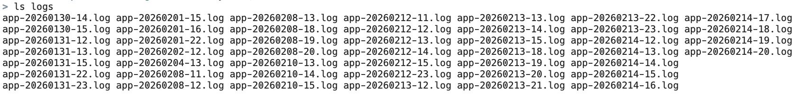

하지만 Stateless 애플리케이션에선 이 방법이 적절하지 않을 수 있습니다. 때문에 아래의 Discord/Slack 웹훅을 통한 알림 기능도 함께 제공하여 실시간으로 로그를 확인할 수 있도록 하였습니다.

### Discord/Slack 웹훅

이 기능을 사용하기 위해선 Discord 또는 Slack에서 Incoming Webhook을 설정해야 합니다. 이 설정은 아래와 같이 가능합니다.

import { Steps } from '@astrojs/starlight/components';

**Discord**

<Steps>

1. Discord에서 특정 채널을 선택하고 설정으로 이동합니다.

    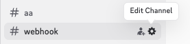

2. Integrations 탭에서 Webhooks를 선택하고 New Webhook을 클릭합니다.

    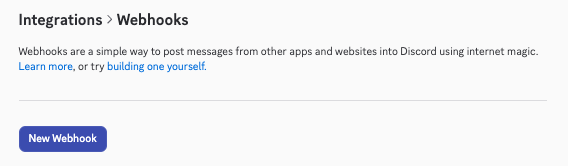

3. Webhook URL을 복사하여 SMCTF 또는 Container Provisioner의 환경 변수 `LOG_DISCORD_WEBHOOK_URL`에 설정합니다.

    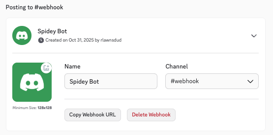

</Steps>

**Slack**

<Steps>

1. Slack에서 특정 채널을 선택하고 세부 정보로 이동합니다.

    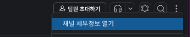

2. Integrations 탭에서 Add an App을 클릭합니다.

    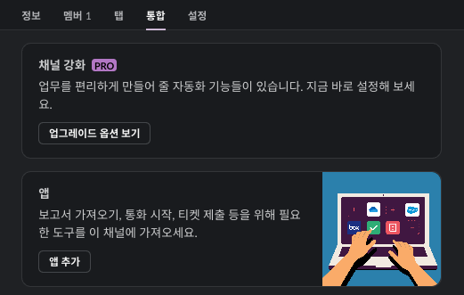

3. Incoming Webhooks 앱을 검색하여 추가합니다.

    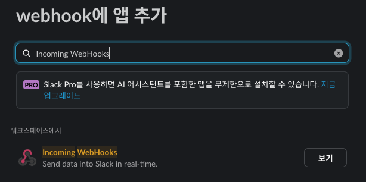

    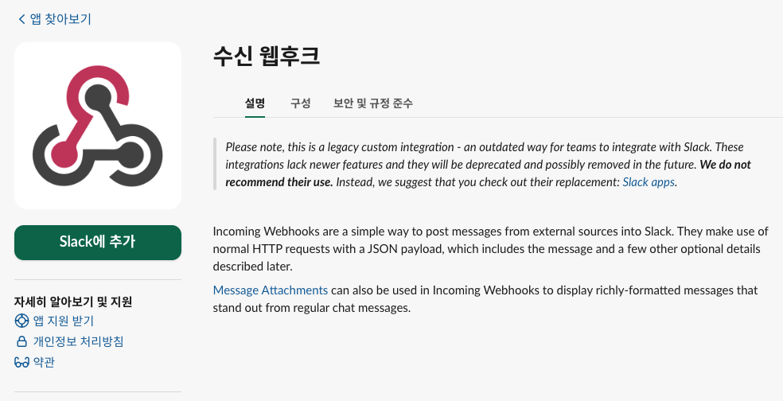

    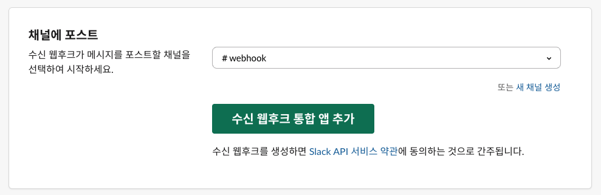

4. Webhook URL을 복사하여 SMCTF 또는 Container Provisioner의 환경 변수 `LOG_SLACK_WEBHOOK_URL`에 설정합니다.

    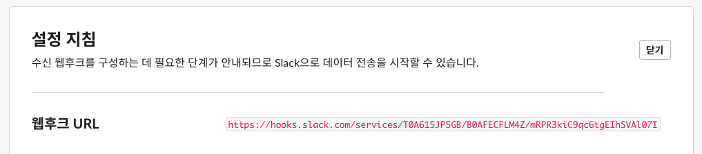

</Steps>

이제 애플리케이션을 재시작하면 Discord 또는 Slack 채널에서 실시간으로 로그를 확인할 수 있습니다. 이때 두 플랫폼 모두 메시지의 길이 제한과 전송 빈도 제한, 레이턴시 등이 존재하기 때문에 자동으로 아래와 같이 설정된 값에 따라 로그를 배치로 전송합니다.

- `LOG_WEBHOOK_QUEUE_SIZE`: 웹훅으로 전송할 로그 메시지의 최대 큐 크기입니다. 
- `LOG_WEBHOOK_BATCH_SIZE`: 큐에 이 값 만큼의 로그 메시지가 쌓이거나 `LOG_WEBHOOK_BATCH_WAIT` 시간 동안 대기하면 배치로 전송됩니다.
- `LOG_WEBHOOK_MAX_CHARS`: 웹훅으로 전송되는 메시지의 최대 문자 수입니다. 이 값을 초과하는 로그 메시지는 자동으로 잘려서 전송됩니다.

**Discord**

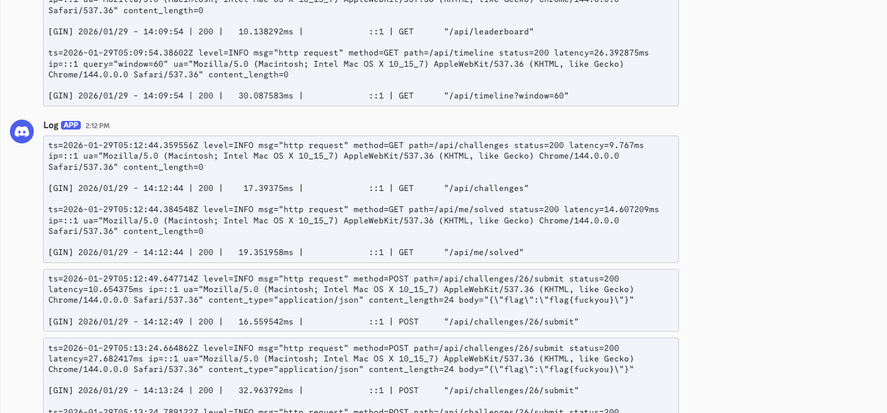

**Slack**

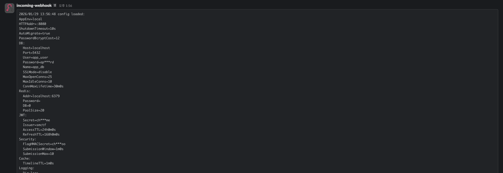

필요에 따라 적절한 값으로 조정하여 사용하면 됩니다.

### OpenTelemetry

> 추후 OpenTelemetry 또는 OpenMetrics를 통한 Observability 지원이 추가될 예정입니다.

### 로깅에 포함되지 않는 항목

보안상 아래와 같이 비밀번호 또는 플래그가 포함된 API 엔드포인트는 로깅되지 않습니다. 추후 민감한 값만 마스킹하는 방식으로 변경될 수 있습니다.

- `/api/auth/login`
- `/api/auth/register`
- `/api/auth/refresh`
- `/api/auth/logout`
- `/api/admin/challenges`
- `/api/admin/challenges/{id}` 
- `/api/challenges/{id}/submit`
