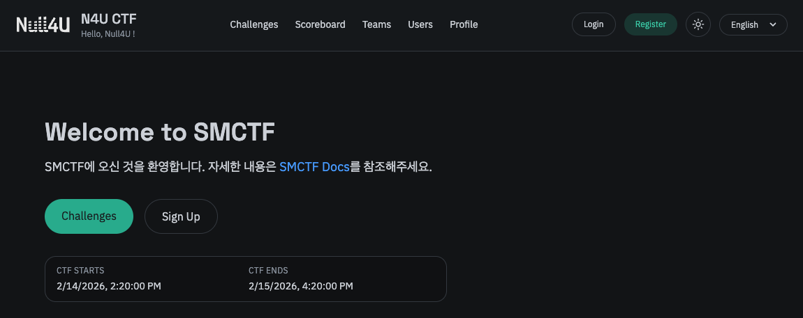
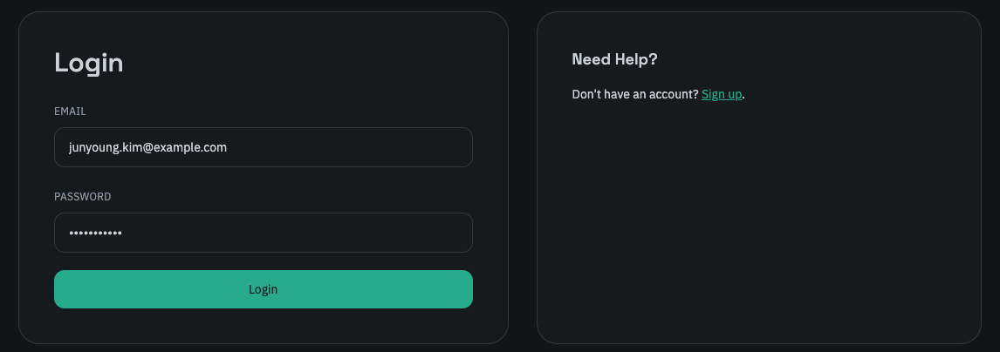
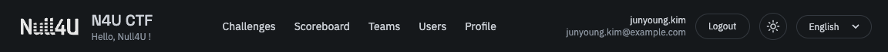

SMCTF는 기본적으로 로그인 없이 문제 리스트를 확인하거나 유저, 팀 등을 조회할 수 있습니다. 하지만 문제 풀이를 위해선 회원가입 및 로그인이 필요하며, 회원가입 시 [가입 인증 키](/smctf/admin/6-key-manage)를 요구합니다.

때문에 CTF 운영자는 참가자들에게 가입 인증 키를 제공해야 하며, 이 인증 키를 바탕으로 소속될 팀이 결정됩니다. 
인증 키는 내부적으로 누가 발급하였는지와 언제, 어떤 사용자가 어떠한 IP로 가입하였는지 상세히 기록됩니다.
이는 신뢰된 참가자들을 선별하는 과정으로, 귀찮은 과정일 수 있지만 안전한 CTF 운영을 위해 꼭 필요한 절차입니다. 

이에 대해선 [가입 인증 키 관리](/smctf/admin/6-key-manage) 문서를 참고하세요.

### 회원가입

CTF 페이지에 접속하면 아래와 같이 로그인 및 회원가입을 진행할 수 있는 버튼이 보여집니다. Sign Up 또는 Register 버튼을 클릭하여 회원가입 페이지로 이동할 수 있습니다.

> Sign Up 또는 Register 버튼을 클릭하세요. 헤더의 언어 설정을 한국어로 변경할 수 있습니다.

이때 앞서 언급한 가입 인증 키를 요구하며, 이는 운영진이 개별적으로 제공해야 합니다. 

> 위 페이지는 관리자 계정으로만 접근할 수 있습니다. 참고용으로 첨부하였습니다.

인증 키는 위와 같이 6자리 숫자로 구성되어 있으며 각 키마다 소속 팀이 지정되어 있습니다. 참가자는 운영진으로부터 인증 키를 전달받아 회원가입 페이지에 입력해야 합니다. 회원가입이 성공적으로 완료되면 로그인을 진행할 수 있습니다.

### 로그인

로그인 후 언제든지 로그아웃할 수 있습니다.

엑세스 키는 내부적으로 JWT Access Token 및 Refresh Token으로 구성되며, 로그인 시 Access Token이 발급되어 세션이 유지됩니다. Access Token은 일정 시간이 지나면 만료되며, 이때 Refresh Token을 사용하여 새로운 Access Token을 발급받아 세션을 유지할 수 있습니다.
이는 내부적으로 자동으로 처리됩니다.
