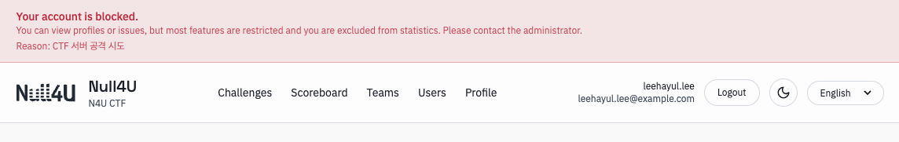

홈 페이지는 CTF의 메인 페이지로, 참가자들이 가장 먼저 접하게 되는 페이지입니다. 때문에 CTF 운영 시 별도로 홈 페이지를 커스터마이징하는 것을 추천합니다.

관리자 페이지에서 [시작/종료 시간 및 사이트 설정](/smctf/admin/7-site-config)을 통해 마크다운으로 페이지를 구성하면 기본적인 구성이 가능하지만, 상세한 커스터마이징을 위해선 [nullforu/smctfe](https://github.com/nullforu/smctfe)를 Fork 또는 Clone하여 직접 수정하는 것을 추천드립니다.

접속 시 위와 같은 홈 페이지가 표시됩니다. 여기서 제목과 설명, 그리고 헤더의 아이콘 옆 텍스트는 관리자 페이지에서 설정할 수 있습니다. 
또한 대회 시작 시간 또는 종료 시간을 설정한 경우, 위 사진과 같이 시작 시간 및 종료 시간이 표시됩니다.

제한(차단)된 유저는 아래와 같이 차단 사유가 표시됩니다. 자세한 내용은 [유저](/smctf/7-users) 및 [유저 관리](/smctf/admin/3-user-manage) 문서를 참고하세요.

