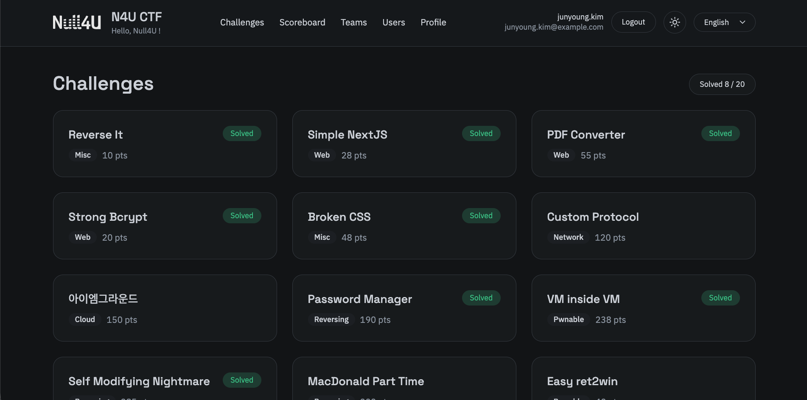
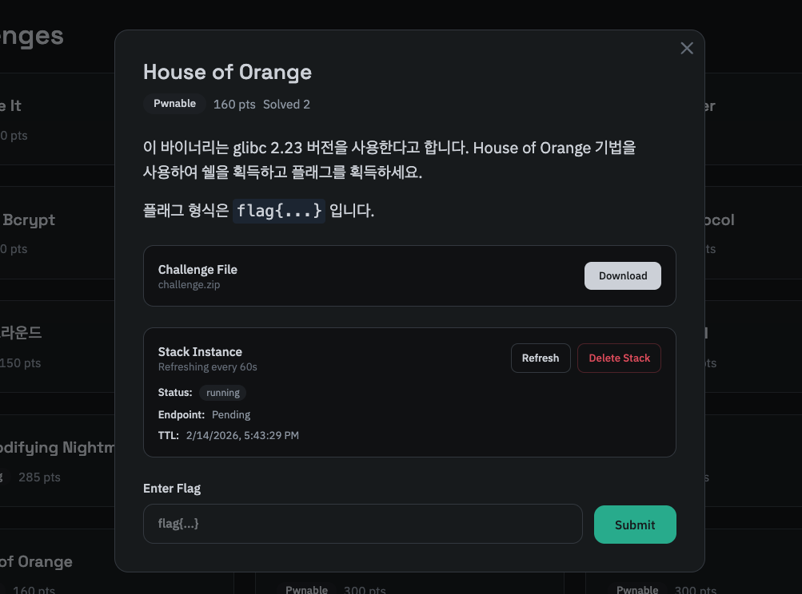
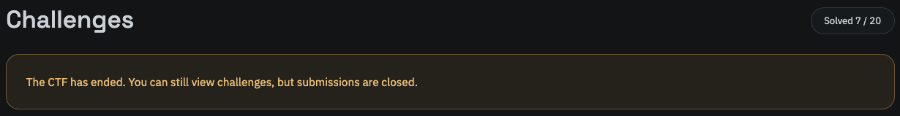

문제 목록은 모든 문제가 나열되는 페이지입니다. 문제의 점수와 제목, 풀이 여부 등이 포함됩니다. 대회 시작 시간을 설정할 경우 시작 전에는 문제의 목록과 상세 정보를 공개하지 않습니다. 이에 대해선 [시작/종료 시간 설정](/smctf/admin/5-site-config) 문서를 참고하세요.

여기서 특정한 문제를 클릭하면 모달 형태로 문제의 상세 정보가 표시됩니다. 문제에는 문제의 제목과 설명, 그리고 문제 풀이에 필요한 ZIP 파일과 [스택](/smctf/12-stack) 정보가 포함되어 있습니다.

> 사진에서 스택 상태의 Pending은 로컬에서 테스트하고 있기 때문에 발생되는 상태로, 실제로는 Public IP 및 31001-32767 사이의 포트가 할당되어 표시됩니다.

- 문제 풀이에 필요한 ZIP 파일은 AWS S3 Presigned URL을 통해 제공되며, 자세한 내용은 [문제 파일 업로드/다운로드](/smctf/13-s3) 문서를 참고하세요.
- 플래그 제출엔 Brute Force 방지로 Rate Limiting이 적용되어 있습니다. 자세한 내용은 [요청 속도 제한 설정](/smctf/16-rate-limit) 문서를 참고하세요.
- 기본적으로 [Dynamic Scoring](/smctf/17-dynamic-score) 시스템이 적용되어 있습니다. 자세한 내용은 해당 문서를 참고하세요.
- 스택에 대한 자세한 내용은 [스택](/smctf/12-stack) 문서를, 기술적인 구현에 대한 자세한 내용은 [Container Provisioner](/container-provisioner) 문서를 참고하세요.

올바른 플래그가 제출되면 문제 풀이가 완료되고, 이는 같은 팀 내에서 공유됩니다. 따라서 팀원들이 동시에 같은 문제에 대한 올바른 플래그를 제출해도 내부적으론 한 번의 문제 풀이로 처리됩니다. 이 점은 프론트엔드에서 별도로 표시되지 않을 수 있으나 이는 문제되지 않습니다.

문제 풀이를 완료하면 진행중이던 스택은 자동으로 삭제됩니다. 또한 더 이상 해당 문제에 대한 스택을 만들 수 없으니 참고하세요.

대회 시작 전엔 문제 목록과 상세 정보가 공개되지 않고, 플래그 제출과 스택 생성 등의 API도 호출할 수 없습니다. 대회 시작 전 아래와 같이 안내됩니다.

또한 대회가 종료되면 아래와 같이 안내 메시지가 나오며, 플래그 제출 및 스택 생성이 불가능합니다.

이는 프론트엔드의 UI 뿐만 아니라 API 레벨에서 제한됩니다.

### 카테고리

문제는 아래와 같은 카테고리로 분류됩니다. 문제 생성 시 카테고리를 지정할 수 있습니다.

- Web
- Web3
- Pwnable
- Reversing
- Crypto
- Forensics
- Network
- Cloud
- Misc
- Programming
- Algorithms
- Math
- AI
- Blockchain
