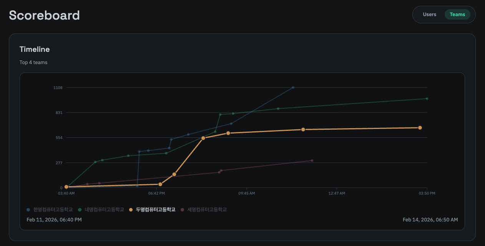
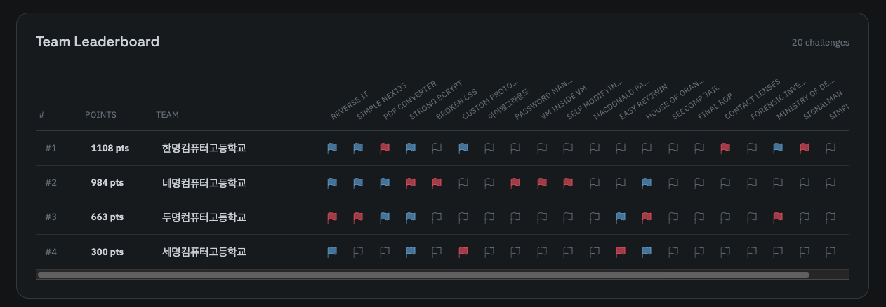

스코어보드는 참가지들이 자신 또는 팀의 점수와 순위를 확인할 수 있는 페이지입니다. 스코어보드는 타임라인과 리더보드로 구성됩니다.

### 타임라인

타임라인은 순위가 높은 상위 10개의 유저나 팀이 표시되며, 각 유저나 팀이 문제를 푼 시간과 점수가 표시됩니다. 

타임라인 그래프에 표시된 점(노드)에 마우스를 호버링하면 아래 사진과 같이 해당 유저나 팀이 문제를 푼 시간과 점수가 표시됩니다. 단기간에 많은 문제를 제출할 경우 일부는 병합되어 보여질 수 있습니다.

또한 아래의 유저나 팀 이름에 마우스를 호버링하면 해당 유저나 팀에 대한 라인이 강조되어 표시됩니다.

타임라인은 PC 환경에서 최적화되어 있으며, 모바일 환경에선 일부 레이아웃이 작아지거나 숨겨질 수 있습니다. 

### 리더보드

리더보드는 점수가 가장 높은 유저나 팀을 기준으로 순위를 매기고, 각 유저나 팀이 어떠한 문제를 풀었는지 표시됩니다.

아무 색이 없는 Flag 모양은 해당 문제를 풀지 못한 경우이며, 빨간색으로 표시된 경우 First Blood로 해당 문제를 가장 먼저 푼 유저나 팀입니다. 파란색으로 표시된 경우 해당 문제를 푼 유저나 팀입니다. 

레이아웃이 PC 환경에서 최적화되어 있으며, 가로 스크롤을 통해 넘치는 부분을 확인할 수 있습니다. 마찬가지로 모바일 환경에선 일부 레이아웃이 작아지거나 숨겨질 수 있습니다.

---

스코어보드는 대회 시작 부터 유저나 팀을 상관하지 않고 마지막으로 문제를 푼 시간까지 자동으로 윈도우가 계산되어 업데이트됩니다.
대회 종료 후에도 마지막으로 문제를 푼 시간까지의 스코어보드를 확인할 수 있습니다.
