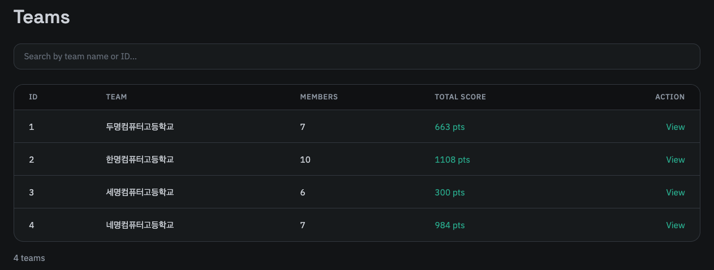
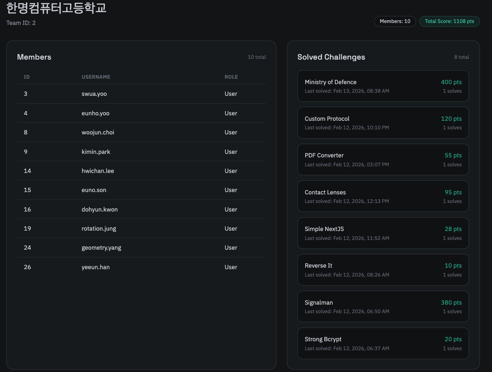

팀은 SMCTF에서 참가자들이 필수적으로 소속되는 최소한의 단위입니다. CTFd의 Team Only와 같이 유저는 항상  어느한 한 팀에 소속되어야 하며, 만약 소속되기를 원치 않을 경우 별도의 개인 팀을 만들어야 합니다.

앞서 언급하였듯 팀은 관리자 페이지에서 만들 수 있으며, 팀에 소속되기 위해선 가입 시 올바른 가입 인증 키를 사용해야 합니다. 이에 대해선 대회 운영진에게 문의하세요.

특정한 팀을 클릭하면 상세한 정보를 확인할 수 있으며, 팀에서 어떠한 문제를 풀었는지와 어떤 유저가 소속되어 있는지 확인할 수 있습니다.
