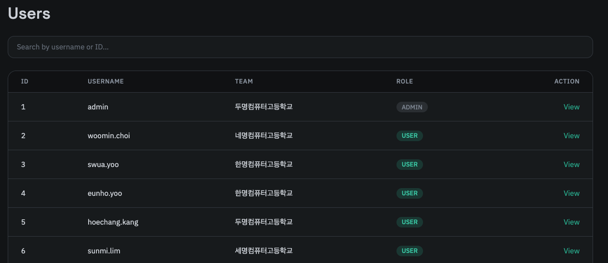
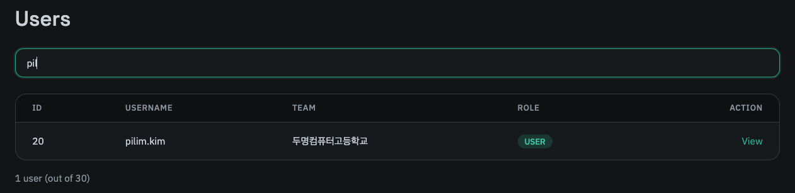

헤더의 Users 탭에서 모든 유저의 목록을 확인할 수 있습니다.

검색은 유저의 ID 또는 이름으로 검색할 수 있습니다.

특정한 유저를 클릭하면 상세한 정보를 확인할 수 있으며, 유저가 어떤 팀에 소속되어 있는지와 어떤 문제를 풀었는지 확인할 수 있습니다.

보안상의 이유로 이메일은 공개하지 않으며, 기초적인 정보만 표시됩니다. 관리자 계정은 Admin 역할, 일반 유저는 User 역할로 RBAC를 구성합니다. 
관리자 계정은 DB에 접근하여 직접 생성하고 Admin 역할을 할당해야 합니다. 이에 대한 자세한 내용은 [설치](/smctf/20-install-and-docker) 문서를 참고해주세요.
