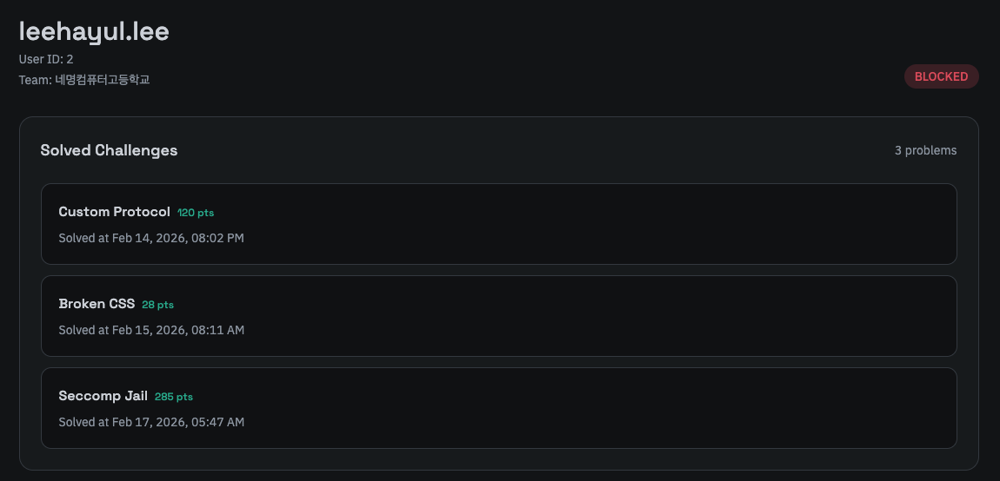
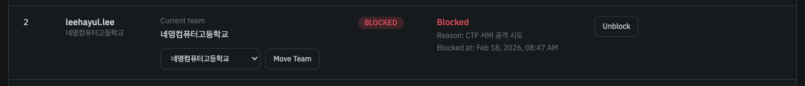

헤더의 Users 탭에서 모든 유저의 목록을 확인할 수 있습니다.

검색은 유저의 ID 또는 이름으로 검색할 수 있습니다.

특정한 유저를 클릭하면 상세한 정보를 확인할 수 있으며, 유저가 어떤 팀에 소속되어 있는지와 어떤 문제를 풀었는지 확인할 수 있습니다.

보안상의 이유로 이메일은 공개하지 않으며, 기초적인 정보만 표시됩니다. 관리자 계정은 Admin 일반 유저는 User 역할로 표시되며 제한(차단)된 유저는 Blocked로 표시됩니다.
관리자 계정은 DB에 접근하여 직접 생성하고 Admin 역할을 할당해야 합니다. 이에 대한 자세한 내용은 [설치](/smctf/20-install-and-docker) 문서를 참고하세요.

### 제한(차단)된 유저

대회 규정이나 운영진의 판단에 따라 유저(계정)은 제한(차단)될 수 있습니다. 제한된 유저는 아래와 같은 제약이 적용됩니다.

- 플래그 제출 및 스택 생성 불가능
- 스코어보드(순위를 포함한 타임라인, 리더보드) 및 Dynamic Scoring 집계에서 제외

유저 제한 시 기존의 제출 기록은 유지됩니다. 
이때 팀 내에서 제한된 유저가 문제를 이미 풀었을 경우, 해당 문제는 팀 내에서 이미 풀이된 것으로 간주되어 다른 팀원들이 해당 문제를 풀이할 수 없습니다.
하지만 팀의 총합 점수에선 제한된 유저가 풀이한 문제의 점수는 제외됩니다. 

제한된 유저는 아래와 같이 차단 사유가 표시됩니다. 차단 사유가 명확하지 않을 경우 관리자 또는 운영진에게 문의하세요.

관리자 페이지의 [유저 관리](/smctf/admin/3-user-manage) 탭에서 유저를 제한(차단)할 수 있습니다. 적절한 사유가 필요하며 언제든지 다시 제한을 해제할 수 있습니다.

import { Aside } from '@astrojs/starlight/components'

<Aside type='caution'>
    아래와 같은 행동을 포함한 CTF 서버를 공격하는 행위는 절대적으로 금지됩니다. 

    - Brute Force 방식의 로그인 시도 또는 플래그 제출 시도
    - 모든 Dos 또는 DDoS 공격과 같이 서버에 과도한 부하를 유발하는 공격 (이는 과도한 새로고침 시도나 생성 시도, 반복적인 규칙이 보이는 비정상적인 API 호출 패턴 등도 포함됩니다.)
    - CTF 서버에 대한 URL/Path 스캐닝 또는 포트 스캐닝, Fuzzing과 같이 서버의 취약점 또는 비공개 엔드포인트 등을 탐색하는 공격
    - 다른 유저의 스택 환경에 대한 무단 엑세스 시도 또는 공격 등의 다른 유저의 풀이를 방해하는 행위
    - 발견된 취약점을 악용하는 행위 (발견된 취약점은 즉시 관리자 또는 운영진에게 보고해야 합니다.)
    
    위 항목 외에도 기타 CTF 서버 또는 다른 유저의 정상적인 이용을 방해하는 모든 행위는 엄격히 금지됩니다.
    이러한 행위가 발견될 경우 해당 유저는 경고 없이 즉시 제한(차단)될 수 있으며, 심각한 경우 법적 조치가 취해질 수 있습니다.

    CTF는 공정한 경쟁과 협력을 기반으로 하는 대회입니다. 모든 참가자는 상호 존중과 공정한 플레이를 추구해야 하며, 다른 참가자의 풀이를 방해하는 행위는 절대적으로 금지됩니다.
    필요에 따라 운영진이 개인적으로 연락하여 상황 설명을 요청할 수 이으며, 협조하지 않을 경우 불이익이 발생할 수 있습니다.
</Aside>
