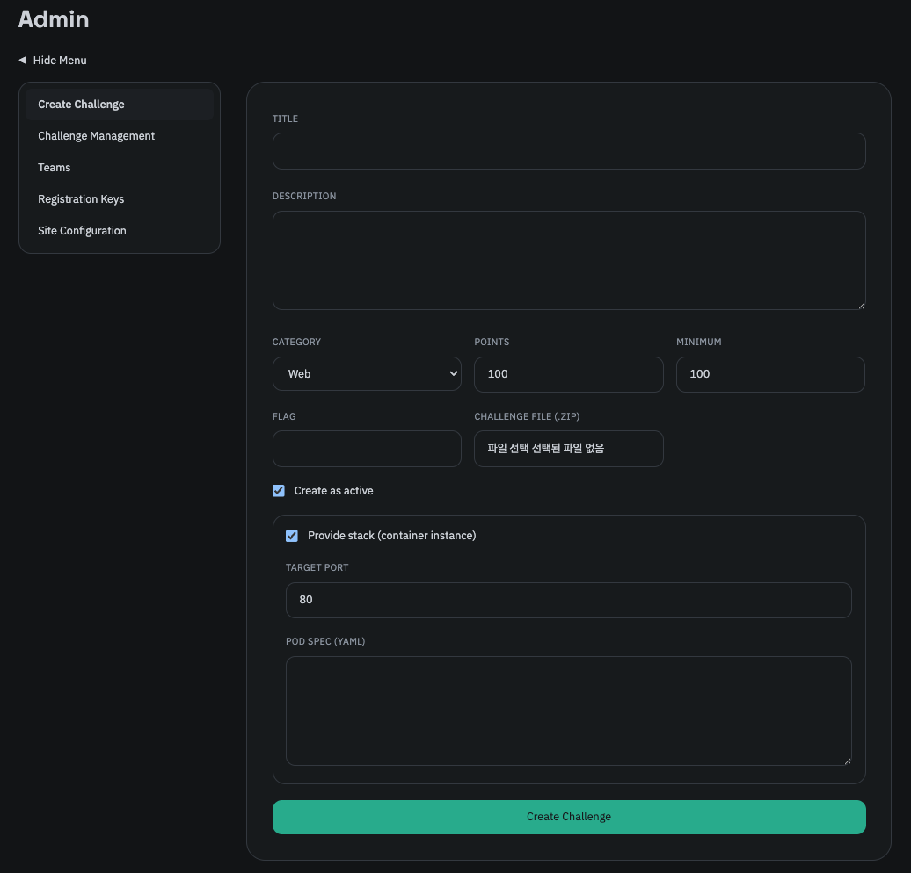
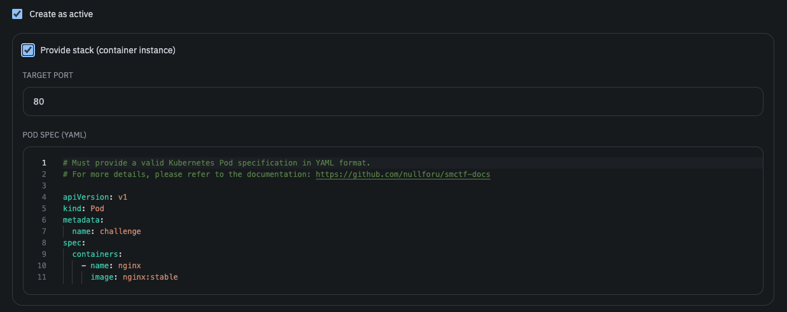

해당 탭에서 문제를 생성할 수 있으며, 아래의 필드를 입력할 수 있습니다.

- 문제 제목 - 가능하다면 직관적이고 간결한 제목을 입력하는 것을 권장합니다.
- 문제 설명 - 마크다운 형식을 지원합니다. 
- 카테고리 - 카테고리 종류는 [문제 목록](/smctf/4-challenges) 문서를 참고하세요.
- 점수 - 문제의 기본 점수를 입력합니다. 이는 [Dynamic Scoring](/smctf/17-dynamic-score) 문서에서 설명합니다.
- 최저 점수 - 문제의 최저 점수를 입력합니다. 이는 [Dynamic Scoring](/smctf/17-dynamic-score) 문서에서 설명합니다.
- 플래그 - 문제 풀이에 필요한 플래그를 입력합니다. 플래그는 대소문자를 구분하며, 만약의 사태를 대비하여 모든 플래그는 HMAC으로 해싱되어 저장됩니다. 플래그는 한번 입력하면 수정할 수 없습니다.
- 문제 파일 - 문제 풀이에 필요한 ZIP 파일을 업로드할 수 있습니다. 이는 AWS S3 Presigned URL을 통해 제공되며, 이는 [문제 파일 업로드/다운로드](/smctf/13-s3) 문서에서 설명합니다.
- 활성화 여부 - 문제의 활성화 여부를 설정할 수 있습니다. 비활성화된 문제는 플래그를 제출할 수 없습니다. 기본 값은 활성화입니다.
- 스택 사용 여부 - 문제 풀이에 [스택](/smctf/12-stack)을 사용할지 여부를 설정할 수 있습니다. 이때 타겟 포트 및 Pod Spec을 명시해야 하는데, 이는 [스택](/smctf/12-stack) 문서에서 설명합니다.

문제 설명은 마크다운 문법을 지원하며, [Monaco](https://microsoft.github.io/monaco-editor/) 에디터를 사용하여 더 쉽게 작성할 수 있습니다. 



Target Port 및 Pod Spec는 Kubernetes Pod Spec을 작성하는 형식으로 입력해야 합니다. 아래는 Nginx 웹 서버를 실행하는 스택을 예시로 작성한 Pod Spec입니다.

```yaml
# Must provide a valid Kubernetes Pod specification in YAML format.
# For more details, please refer to the documentation: https://github.com/nullforu/smctf-docs

apiVersion: v1
kind: Pod
metadata:
  name: challenge
spec:
  containers:
    - name: nginx
      image: nginx:stable
      ports:
        - containerPort: 80
      resources:
        requests:
          cpu: "50m"
          memory: "64Mi"
        limits:
          cpu: "50m"
          memory: "64Mi"
```

이는 인프라 팀과 협업하여 적절한 리소스 요건과 설정을 갖춘 Pod Spec을 작성해야 합니다.


