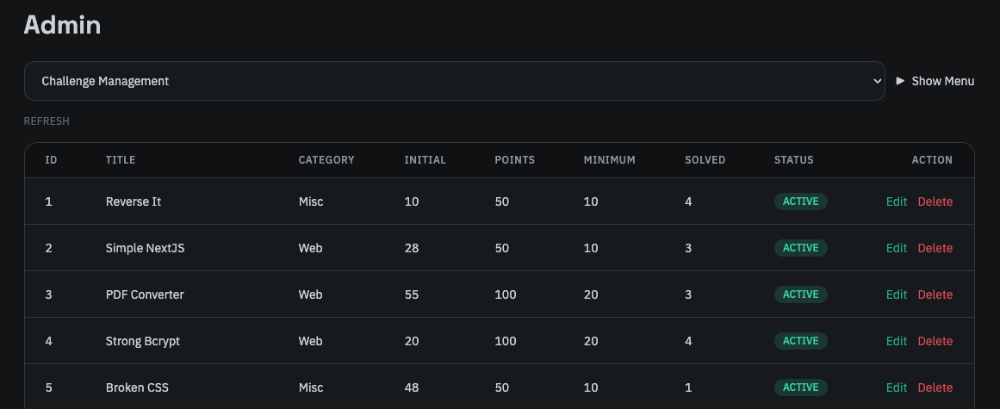
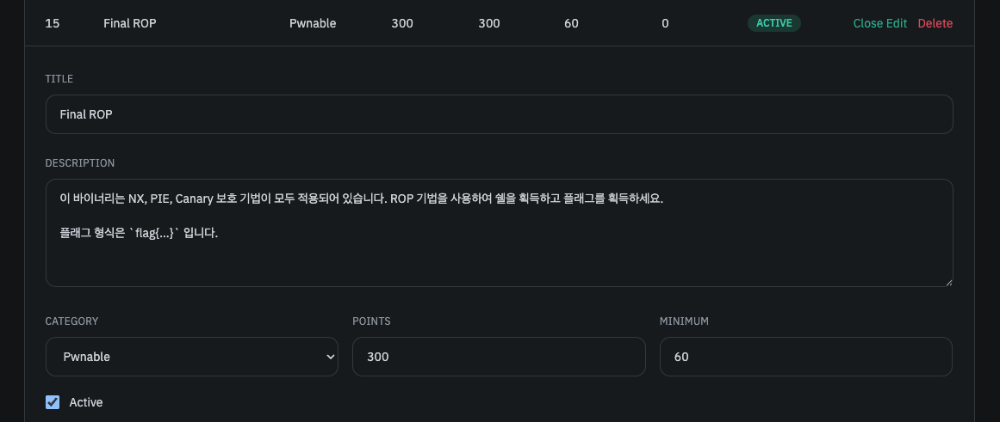
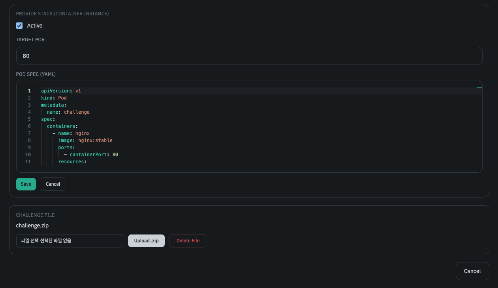

이 탭에선 기존의 문제를 수정하거나 삭제할 수 있습니다. 

Action 중 Edit을 클릭하면 문제에 대한 정보를 수정할 수 있으며, Delete를 클릭하면 문제를 삭제할 수 있습니다. 

import { Aside } from '@astrojs/starlight/components';

<Aside type="danger">
문제를 삭제할 경우 해당 문제에 대한 모든 플래그 제출 기록과 점수 등이 모두 삭제됩니다.
</Aside>

문제에서 플래그는 수정할 수 없습니다. 플래그를 수정하려면 문제를 삭제한 후 다시 생성하세요.
