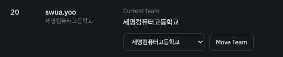

유저에 대해 팀 이동이나 제한(차단) 등의 관리를 할 수 있습니다. `v1.1.0` 릴리즈 기준 아래의 2가지 기능이 존재합니다.
그 외의 유저 관리 기능은 추후 업데이트될 예정이나, 직접 DB에 접근하여 유저 정보를 수정하는 것도 가능합니다.

### 팀 이동

유저를 다른 팀으로 이동시킬 수 있습니다. 팀 이동시 해당 유저가 기존에 제출하였던 제출 기록과 점수가 모두 새로운 팀으로 이동됩니다. 때문에 팀 이동은 유저의 점수와 랭킹에 영향을 미칠 수 있으므로, 명확한 사유가 있는 경우에만 사용하세요.

현재 팀에서 다른 팀을 선택하고 `Move Team` 버튼을 눌러 팀 이동을 수행할 수 있습니다. 

### 제한(차단) 관리

제한(차단) 시 받는 불이익에 대해선 [유저](/smctf/7-users) 문서를 참고하세요. 제한(차단) 시 마땅한 차단 사유를 입력해야 합니다. 차단 사유는 유저가 웹 페이지에 접속했을 때 표시됩니다.

차단 시 해당 유저의 역할은 `Blocked`로 변경되며 차단 사유 및 차단 일시가 기록됩니다. 관리자(Admin)는 차단할 수 없습니다.

`Unblock` 버튼을 눌러 차단을 해제할 수 있습니다. 차단이 해제되면 해당 유저의 역할은 `User`로 변경되고, 차단 사유 및 차단 일시가 삭제됩니다.
