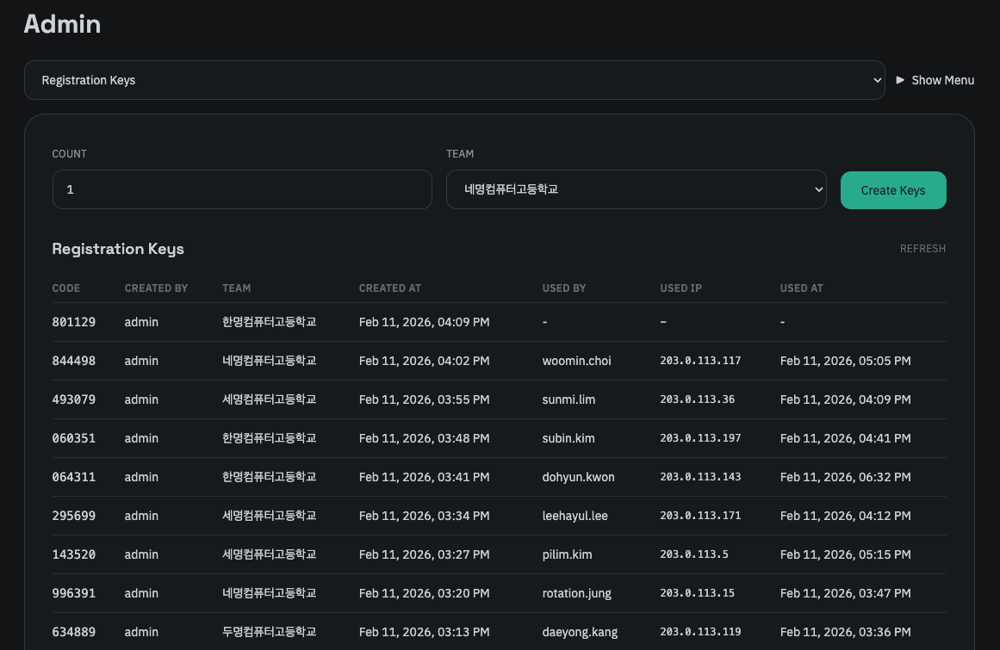

가입 인증 키 관리 탭에선 회원가입 시 사용되는 가입 인증 키를 생성할 수 있습니다. 정식 명칭은 Registration Key입니다.

이 인증 키는 계정을 생성함과 동시에 지정된 팀에 소속되도록 하는 솔루션으로, 팀을 생성하고 하나의 팀을 하나의 가입 인증 키에 매핑하여 팀에 소속된 유저만이 해당 팀에 가입할 수 있도록 하는 방식입니다.

키를 만들때 팀을 지정하고 만들고자하는 인증 키의 개수를 입력합니다. 하나의 키는 하나의 계정에서만 사용할 수 있습니다.

또한 이 탭에선 개별적인 인증 키에 대한 발급자 정보와 사용 여부 등을 확인할 수 있습니다. 제공하는 정보는 다음과 같습니다.

- 인증 키 - 6자리 숫자로 이루어진 가입 인증 키입니다.
- 발급자 - 해당 인증 키를 발급한 운영진의 이름입니다.
- 팀 - 해당 인증 키가 매핑된 팀의 이름입니다.
- 생성 일시 - 해당 인증 키가 생성된 날짜와 시간입니다.
- 사용 여부 및 사용자 - 해당 인증 키를 어떤 유저가 사용했는지에 대한 정보입니다.
- IP - 해당 인증 키가 사용되었다면 어떤 IP에서 사용되었는지에 대한 정보입니다.
- 사용 일시 - 해당 인증 키가 사용되었다면 언제 사용되었는지에 대한 정보입니다.

보안상 추후 6자리 숫자가 아닌 더욱 복잡한 인증 키로 변경하는 것을 고려중입니다. 또한 하나의 인증키로 여러 계정을 생성할 수 있도록 하는 기능도 추후 업데이트 예정입니다.
