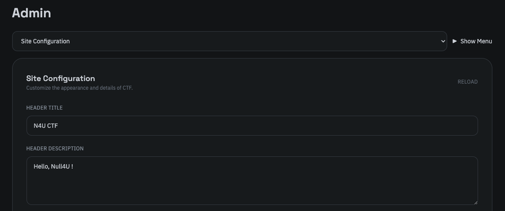
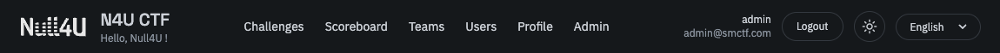
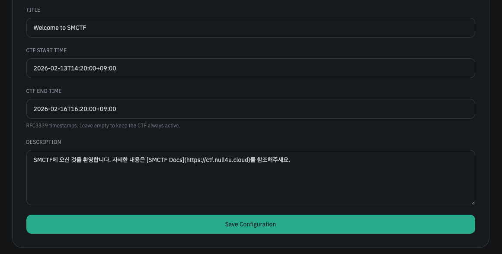
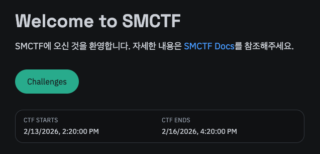

마지막으로 사이트 설정 탭에선 대회 시작 시간과 종료 시간, 홈 페이지의 제목과 설명, 그리고 헤더의 아이콘 옆 텍스트를 설정할 수 있습니다.



이는 아래와 같이 표시됩니다.



아이콘 변경을 포함한 여러 커스터마이징 요소를 추후 업데이트할 예정입니다. 



아래의 제목과 설명은 홈 페이지에 표시되는 제목과 설명으로, 설명은 마크다운 형식을 지원합니다.



대회 시작 시간 및 종료 시간은 아래와 같이 RFC 3339 형식으로 입력해야 합니다. 서버는 UTC 시간대를 사용하므로, 대한민국 시간대인 UTC+9로 입력하려면 아래와 같이 입력해야 합니다.

```
2026-02-14T14:20:00+09:00
```

대회 시작 시간과 종료 시간을 설정한 경우, 대회 시작 전에는 문제의 목록과 상세 정보가 공개되지 않으며, 대회 종료 후에는 문제 풀이가 불가능해집니다. 이에 대해선 [문제 목록](/smctf/4-challenges) 문서를 참고하세요.

만약 시작 시간 또는 종료 시간 필드를 비워둔 경우 시작 시간 또는 종료 시간에 대한 제한이 없어집니다. 두 값은 서로 독립적으로 설정됩니다. 
