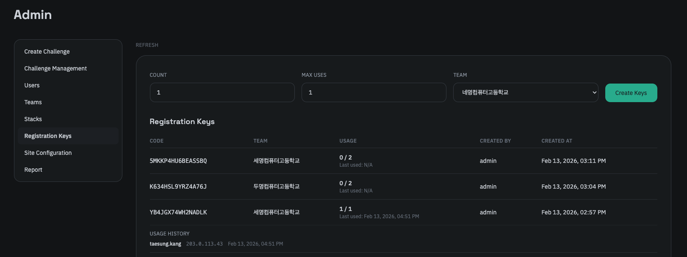
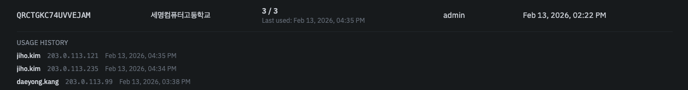

### 키 생성 

회원가입 시 사용되는 가입 인증 키를 생성할 수 있습니다. 정식 명칭은 Registration Key입니다.

가입 인증 키는 계정을 생성함과 동시에 지정된 팀에 소속되도록 하는 솔루션으로, 팀을 생성하고 하나의 팀을 하나의 가입 인증 키에 매핑하여 팀에 소속된 유저만이 해당 팀에 가입할 수 있도록 하는 방식입니다.

키를 만들때 팀을 지정하고 만들고자하는 인증 키의 개수와 최대 사용 횟수를 입력하여 생성할 수 있습니다. 
최대 사용 횟수는 예정된 팀의 인원 수와 동일하게 설정하세요. (스택 과다 사용 방지)

### 키 사용 내역

또한 이 탭에선 개별적인 인증 키에 대한 발급자 정보와 사용 여부, 사용 목록 등을 확인할 수 있습니다. 제공하는 정보는 다음과 같습니다.

- 인증 키 - 16자리의 랜덤한 숫자 및 문자로 이루어진 가입 인증 키입니다. 이때 헷갈릴 수 있는 문자(`0`, `O`, `1`, `I`)는 제외됩니다.
- 팀 - 해당 인증 키가 매핑된 팀의 이름입니다.
- 사용 횟수 및 마지막 사용 일시 - 해당 인증 키가 몇 번, 그리고 언제 마지막으로 사용되었는지에 대한 정보입니다.
- 발급자 - 해당 인증 키를 발급한 운영진의 이름입니다.
- 생성 일시 - 해당 인증 키가 생성된 날짜와 시간입니다.

아래의 정보는 해당 인증 키가 사용된 경우에만 제공되며, 사용한 유저에 대한 목록으로 제공됩니다.

- 사용자 - 해당 인증 키를 어떤 유저가 사용했는지에 대한 정보입니다.
- IP - 해당 인증 키가 사용되었다면 어떤 IP에서 사용되었는지에 대한 정보입니다.
- 사용 일시 - 해당 인증 키가 사용되었다면 언제 사용되었는지에 대한 정보입니다.

이때 기록되는 정보는 사용자에 대한 행동 추적이나 IP 제한 등의 보안 조치에 활용될 수 있으며, 잘못된 팀 배정을 방지하기 위한 로그 등으로 활용될 수 있습니다. 
때문에 가입 인증 키 사용 내역은 삭제할 수 없습니다. 
