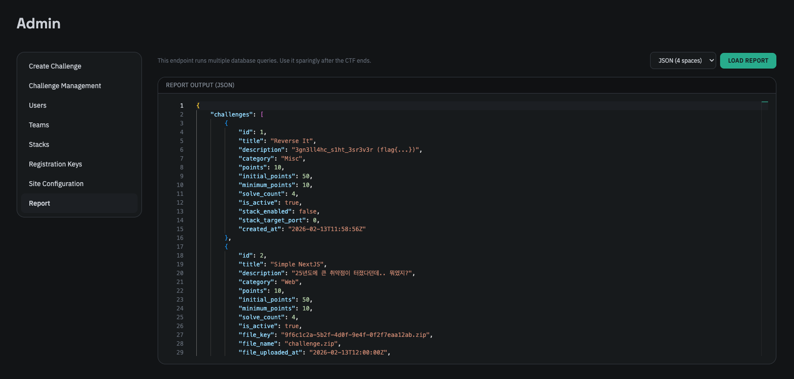
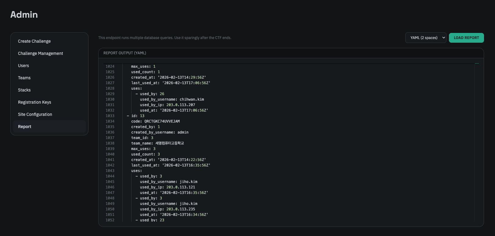

대회가 종료된 후 대회 보고서 탭에서 대회에 대한 다양한 통계와 대부분의 정보를 내보낼 수 있습니다. 이는 JSON 또는 YAML 형식으로 내보낼 수 있으며, 대회 결과 분석이나 향후 대회 준비에 활용할 수 있습니다.

보고서엔 대부분의 정보가 포함되지만, 플래그 값과 사용자의 비밀번호화 같은 민감한 정보는 포함되지 않습니다. 

import { Aside } from '@astrojs/starlight/components';

<Aside type="danger">
    Report API는 내부적으로 많은 DB 쿼리가 실행되고 큰 데이터를 응답 받습니다. 때문에 백엔드에 대한 부하를 유발할 수 있으므로 대회가 진행 중일 때는 Report API를 사용하지 않는 것을 권장합니다. 대회가 종료된 후에만 해당 기능을 사용하여 사용하여 대회 보고서를 생성하는 것을 권장합니다.
</Aside>
