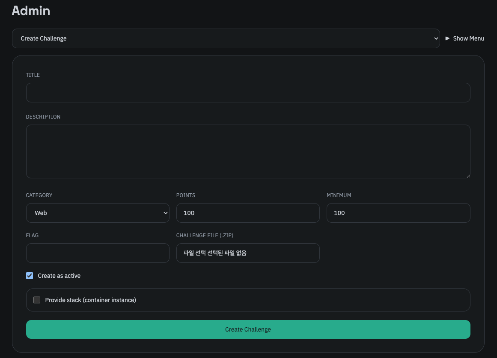
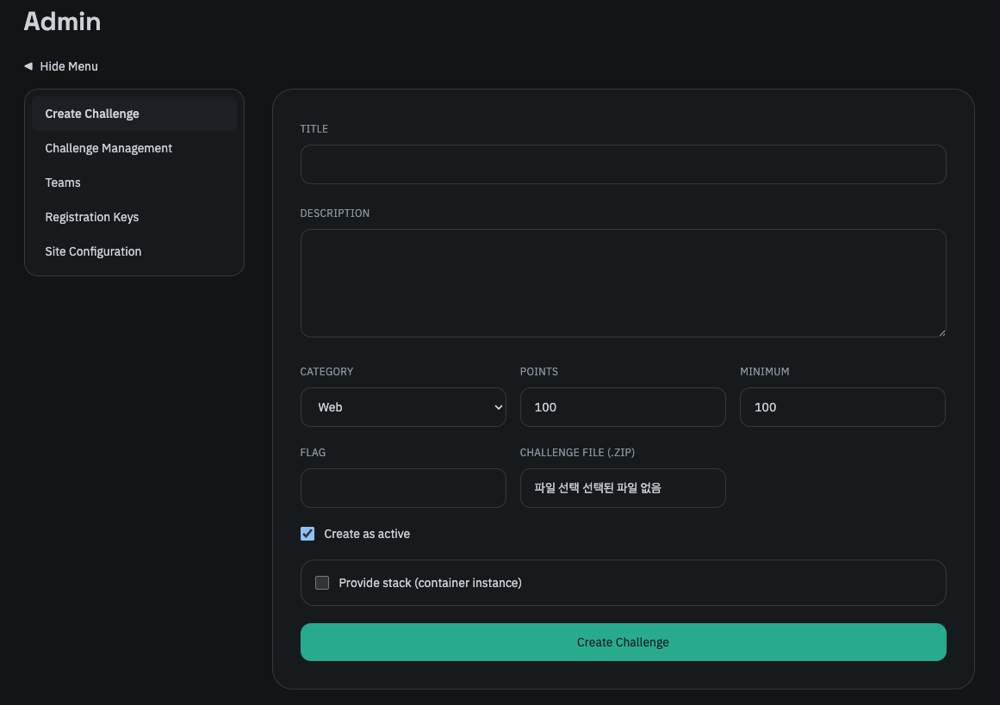

관리자 페이지는 RBAC에서 Admin 역할을 가진 유저만 접근할 수 있으며, Admin 역할을 할당하는 방법은 [설치](/smctf/20-install-and-docker) 문서에서 확인할 수 있습니다.

관리자 페이지는 크게 아래와 같은 탭으로 구성되어 있습니다. (이는 추후 업데이트에 따라 변경될 수 있습니다.)

- Create Challenge
- Challenge Management
- Teams
- Registration Keys
- Site Configuration

각각의 탭에 대한 자세한 설명은 다음 페이지에서 설명합니다. 각 탭은 2가지 UI 스타일로 접근할 수 있습니다.

또는 아래와 같이 사이드바 형태로 변경할 수 있습니다. (Show Menu/Hide Menu)

