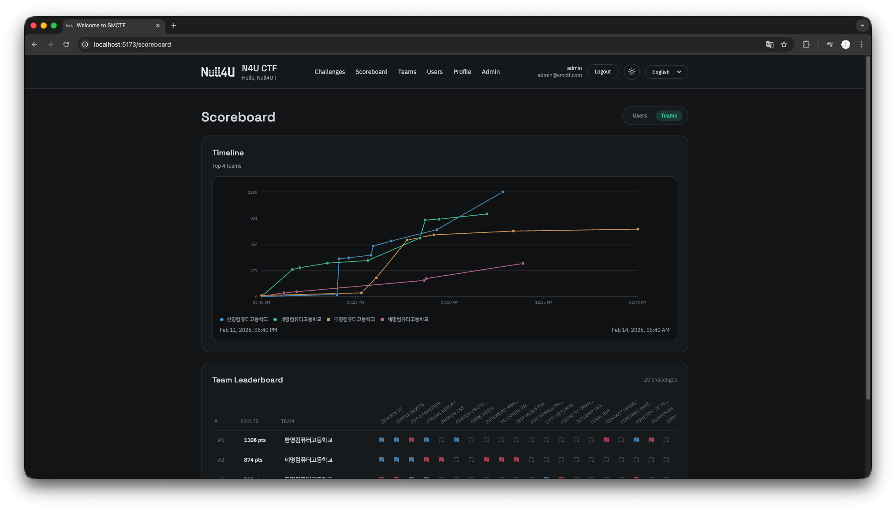

**SMCTF**는 세명컴퓨터고등학교의 DevOps 및 클라우드 컴퓨팅 동아리인 [Null4U](https://github.com/nullforu)에서 개발된 CTF 플랫폼입니다.

쉬운 사용성과 유연한 배포, 그리고 기본적으로 제공되는 문제별 컨테이너 기반의 격리된 환경을 특징으로 하는 CTF 플랫폼으로, 누구나 MIT License를 기반으로 자유롭게 사용하고 기여할 수 있습니다. 

_(기여시 가이드라인을 참조해주세요.)_

### 프로젝트 배경

기존의 CTF 플랫폼을 사용하여 [SCA](https://www.instagram.com/smc.sec_sca)와 같은 해킹/보안 동아리에서 CTF 대회를 개최하는데 있어 아래와 같은 문제점이 있었고, 실제로 이로 인해 대회 운영에 차질이 있었기도 했습니다.

- 기존 오픈소스 CTF 플랫폼을 사용하기 위해선 이에 따른 학습이 필요하였으며, 불필요한 기능 또한 포함되어 있어 러닝 커브가 있었음.
- 각 문제에 대한 개별적인 컨테이너 환경 또는 인스턴스/VM 환경을 제공하기가 어려웠으며, 검증되지 않은 외부 플러그인을 통한 솔루션은 신뢰되지 않았음.
- DB와 프론트엔드를 포함한 전체적인 시스템이 단일 Docker 컨테이너 이미지로 제공되었기 때문에 유연한 배포가 어렵고, 이에 따른 인스턴스 부하가 발생하였음.
- 상세한 로깅이나 모니터링과 같은 Observability 기능이 부족하여 대회 운영에 어려움이 있었음.

이러한 이유로 세명컴퓨터고등학교에서 자체적인 CTF 플랫폼을 기획하였고, 교외에서도 사용할 수 있도록 MIT License 아래에서 오픈소스로 공개하였습니다. 

기획된 새로운 플랫폼은 쉬운 사용성과 유연한 배포, 그리고 문제별 격리된 환경을 기본적으로 제공하며 대회 운영에 필요한 인프라 배포를 위한 Terraform 코드나 보고계신 문서가 자세히 제공됩니다.

---

> SMCTF는 세명컴퓨터고등학교의 약칭인 SMC와 CTF의 합성어로, SMCTF라는 이름은 세명컴퓨터고등학교에서 개발된 CTF 플랫폼이라는 의미를 담고 있습니다.
> 
> 또한 프로젝트 구조의 smctfe는 SMCTF와 Frontend(FE)의 합성어로, SMCTF의 프론트엔드 부분을 담당하는 레포지토리입니다. 각 레포지토리는 역할에 따라 독립적으로 유지보수됩니다. 
> 
> - **Backend**: [nullforu/smctf](https://github.com/nullforu/smctf)
> - **Frontend**: [nullforu/smctfe](https://github.com/nullforu/smctfe)
> - **Container Provisioner**: [nullforu/smctf-provisioner](https://github.com/nullforu/smctf-provisioner)
> - **Infra**: [nullforu/smctf-infra](https://github.com/nullforu/smctf-infra)
> - **Docs**: [nullforu/smctf-docs](https://github.com/nullforu/smctf-docs)
> 
> 여기서 Container Provisioner는 각 문제에 대한 독립적인 컨테이너 환경(스택)을 제공하는 마이크로서비스로, [Container Provisioner](/container-provisioner) 문서에서 자세히 설명합니다.

각 기능들에 대해선 다음 페이지부터 자세히 설명합니다. 언급되지 않은 부분이 있을 수 있으니, 이러한 부분에 대해선 Docs 레포지토리에 PR 또는 이슈로 남겨주시면 감사드리겠습니다.

### Tech Stack

프로젝트는 다음과 같은 기술로 구현되었습니다. 

- Backend: [Go](https://go.dev/), [Gin](https://github.com/gin-gonic/gin), [Bun ORM](https://bun.uptrace.dev/)
- Container Provisioner: [Go (nullforu/container-provisioner-k8s)](https://github.com/nullforu/container-provisioner-k8s)
- Frontend: [React (nullforu/smctfe)](https://github.com/nullforu/smctfe)
- Database, Cache: [PostgreSQL](https://www.postgresql.org/)(instead of MySQL/MariaDB), [Redis](https://redis.io/)
- Testing: [Testcontainers for Go](https://github.com/testcontainers/testcontainers-go)
- Infra, CI/CD (TBD): AWS, EKS, Terraform, Cloudflare, GitHub Actions, etc.
